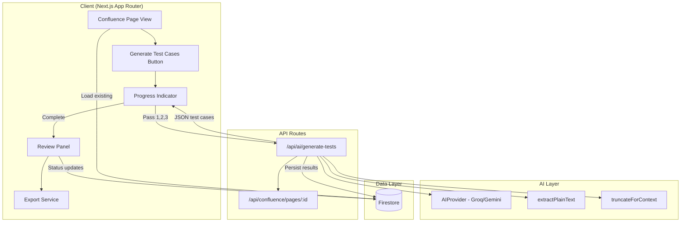
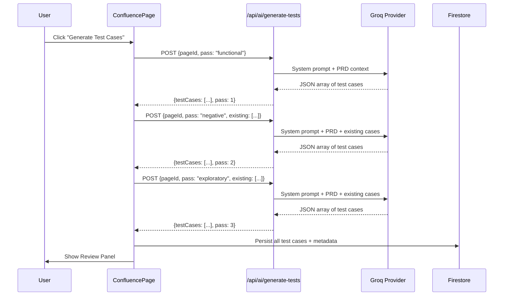

# Design Document: AI Test Case Generator

## Overview

The AI Test Case Generator extends the existing Confluence PRD intelligence suite by adding automated test case generation from PRD documents. It builds on the established AI provider infrastructure (Groq/Gemini), text extraction pipeline, and Confluence page viewer to deliver a multi-pass generation workflow that produces structured, reviewable, and exportable test cases.

The system executes three sequential AI generation passes — functional, negative, and exploratory — each producing structured JSON arrays of test cases. These are persisted in Firestore, presented in a tabbed review UI with accept/edit/reject actions, and exportable to Excel (.xlsx with category sheets) or CSV.

### Key Design Decisions

1. **Extended AIProvider with configurable token limits** — The existing `askAI` interface is reused, but a new `generateTestCases` function wraps it with higher `max_tokens` (8192) and `temperature` (0.4) settings suitable for structured generation rather than Q&A.
2. **Client-side orchestration with API routes** — Generation is triggered client-side, calling a new `/api/ai/generate-tests` route for each pass. Progress state is managed in React state with polling-free design (sequential awaits).
3. **Firestore for persistence** — Test cases are stored per PRD page in a `testCaseGenerations` collection, with subcollection `testCases` for individual cases. This supports incremental review updates without re-writing entire arrays.
4. **Client-side export** — Excel generation uses `xlsx` (SheetJS) library client-side to avoid server-side memory pressure. CSV is generated natively.

## Architecture



### Generation Flow (Sequence)



## Components and Interfaces

### 1. Generation API Route (`/api/ai/generate-tests/route.ts`)

```typescript
// POST /api/ai/generate-tests
interface GenerateTestsRequest {
  pageId: string;
  pass: 'functional' | 'negative' | 'exploratory';
  existingTestCases?: TestCaseSummary[]; // previous pass results for dedup
}

interface GenerateTestsResponse {
  testCases: GeneratedTestCase[];
  pass: number;
  totalInPass: number;
  modelUsed: string;
}

interface TestCaseSummary {
  id: string;
  scenario: string;
  category: string;
}
```

This route:
- Fetches the Confluence page content (reusing existing Confluence API pattern)
- Extracts plain text and headings via `extractPlainText`
- Truncates for context via `truncateForContext` (with extended budget of 16000 tokens for generation)
- Constructs a pass-specific system prompt requesting JSON output
- Calls the AI provider with extended `max_tokens: 8192`
- Parses and validates the JSON response
- Returns structured test cases

### 2. AI Generation Service (`src/lib/ai/testCaseGenerator.ts`)

```typescript
interface GeneratedTestCase {
  testcaseId: string;       // e.g. TC_FUNC_001
  module: string;           // PRD section heading
  priority: 'P0' | 'P1' | 'P2';
  testScenario: string;
  testSteps: string[];      // ordered steps
  expectedResult: string;
  category: TestCaseCategory;
}

type TestCaseCategory = 'Functional' | 'Negative' | 'Exploratory' | 'Sanity' | 'Edge Case';

interface GenerationConfig {
  maxTokens: number;        // 8192 for generation
  temperature: number;      // 0.4 for structured output
  maxRetries: number;       // 3 with exponential backoff
  contextTokenBudget: number; // 16000 chars
}

// Core generation function
async function generateTestCasesForPass(
  prdText: string,
  prdHeadings: string[],
  pass: 'functional' | 'negative' | 'exploratory',
  existingCases: TestCaseSummary[],
  config: GenerationConfig
): Promise<GeneratedTestCase[]>;

// Heading extractor
function extractHeadings(plainText: string): string[];

// JSON parser with validation
function parseTestCaseResponse(raw: string): GeneratedTestCase[];
```

### 3. Firestore Service (`src/lib/ai/testCaseStore.ts`)

```typescript
// Persist generation results
async function saveGenerationResult(
  pageId: string,
  testCases: GeneratedTestCase[],
  metadata: GenerationMetadata
): Promise<string>; // returns generation doc ID

// Load existing test cases for a page
async function loadTestCases(pageId: string): Promise<StoredTestCase[] | null>;

// Update review status for a single test case
async function updateTestCaseReview(
  pageId: string,
  testcaseId: string,
  update: TestCaseReviewUpdate
): Promise<void>;

// Check if generation exists for a page
async function hasExistingGeneration(pageId: string): Promise<boolean>;

// Delete existing generation (for regeneration)
async function deleteGeneration(pageId: string): Promise<void>;
```

### 4. Review Panel Component (`src/components/TestCaseReviewPanel.tsx`)

```typescript
interface TestCaseReviewPanelProps {
  pageId: string;
  pageTitle: string;
  testCases: StoredTestCase[];
  onClose: () => void;
}

// Sub-components:
// - CategoryTabs: Tab navigation for Functional/Negative/Exploratory/Sanity/Edge Case
// - TestCaseTable: Sortable, filterable table per category
// - TestCaseEditForm: Inline editing modal for individual test cases
// - ReviewSummaryBar: Counts of accepted/edited/rejected/pending
// - ExportButtons: Excel and CSV download triggers
```

### 5. Export Service (`src/lib/ai/testCaseExport.ts`)

```typescript
// Generate Excel workbook with category sheets
function generateExcelExport(
  testCases: StoredTestCase[],
  prdTitle: string
): Blob;

// Generate CSV with category column
function generateCsvExport(
  testCases: StoredTestCase[],
  prdTitle: string
): string;

// Trigger browser download
function downloadBlob(blob: Blob, filename: string): void;
```

### 6. Progress Indicator Component (`src/components/TestGenProgress.tsx`)

```typescript
interface TestGenProgressProps {
  currentPass: number;    // 1, 2, or 3
  passName: string;       // "Functional", "Negative", "Exploratory"
  totalGenerated: number; // running count
  isComplete: boolean;
}
```

## Data Models

### Firestore Schema

```
testCaseGenerations/
  {pageId}/
    metadata: {
      pageId: string
      pageTitle: string
      generatedAt: Timestamp
      totalCount: number
      modelVersion: string
      categories: {
        functional: number
        negative: number
        exploratory: number
        sanity: number
        edgeCase: number
      }
    }
    testCases/
      {testcaseId}/
        testcaseId: string
        module: string
        priority: 'P0' | 'P1' | 'P2'
        testScenario: string
        testSteps: string[]
        expectedResult: string
        category: TestCaseCategory
        reviewStatus: 'pending' | 'accepted' | 'edited' | 'rejected'
        editedFields?: Partial<TestCaseFields>
        sourceVerified: boolean
        createdAt: Timestamp
        updatedAt: Timestamp
```

### TypeScript Interfaces (Full)

```typescript
// src/types/test-cases.ts

export type TestCaseCategory = 'Functional' | 'Negative' | 'Exploratory' | 'Sanity' | 'Edge Case';
export type ReviewStatus = 'pending' | 'accepted' | 'edited' | 'rejected';
export type Priority = 'P0' | 'P1' | 'P2';

export interface GeneratedTestCase {
  testcaseId: string;
  module: string;
  priority: Priority;
  testScenario: string;
  testSteps: string[];
  expectedResult: string;
  category: TestCaseCategory;
}

export interface StoredTestCase extends GeneratedTestCase {
  reviewStatus: ReviewStatus;
  editedFields?: Partial<Omit<GeneratedTestCase, 'testcaseId' | 'category'>>;
  sourceVerified: boolean;
  createdAt: Date;
  updatedAt: Date;
}

export interface GenerationMetadata {
  pageId: string;
  pageTitle: string;
  generatedAt: Date;
  totalCount: number;
  modelVersion: string;
  categories: Record<TestCaseCategory, number>;
}

export interface TestCaseReviewUpdate {
  reviewStatus: ReviewStatus;
  editedFields?: Partial<Omit<GeneratedTestCase, 'testcaseId' | 'category'>>;
}
```

### AI Prompt Templates

The system prompts instruct the model to return a JSON array. Each pass has a tailored prompt:

**Functional Pass:**
```
You are a senior QA engineer generating test cases from a PRD.
Generate FUNCTIONAL/HAPPY-PATH test cases covering normal user flows.
For each test case, reference the specific PRD section heading in the "module" field.
Available sections: {headings}

Return a JSON array with this exact structure:
[{"testcaseId": "TC_FUNC_001", "module": "...", "priority": "P0|P1|P2", "testScenario": "...", "testSteps": ["1. ...", "2. ..."], "expectedResult": "...", "category": "Functional"}]
```

**Negative Pass (includes existing cases for deduplication):**
```
You are a senior QA engineer. Generate NEGATIVE/BOUNDARY test cases.
Focus on: invalid inputs, boundary values, error conditions, permission violations.
Do NOT duplicate these existing test scenarios: {existingSummaries}
...
```

**Exploratory Pass:**
```
You are a senior QA engineer. Generate EXPLORATORY/EDGE-CASE test cases.
Focus on: unusual workflows, race conditions, data combinations, stress scenarios.
You may also add Sanity cases (basic smoke tests) where appropriate.
Categorize as "Exploratory", "Edge Case", or "Sanity".
...
```


## Correctness Properties

*A property is a characteristic or behavior that should hold true across all valid executions of a system — essentially, a formal statement about what the system should do. Properties serve as the bridge between human-readable specifications and machine-verifiable correctness guarantees.*

### Property 1: Test Case Parsing Resilience

*For any* JSON string returned by the AI provider (whether well-formed, partially malformed, or containing a mix of valid and invalid entries), the `parseTestCaseResponse` function SHALL return only valid `GeneratedTestCase` objects with all required fields correctly typed, and SHALL discard any entries that cannot be parsed into valid objects.

**Validates: Requirements 2.3, 2.6**

### Property 2: Structural Validity of Generated Test Cases

*For any* parsed `GeneratedTestCase` object, it SHALL have: a non-empty `testcaseId` string, a non-empty `module` string, a `priority` value in the set {"P0", "P1", "P2"}, a non-empty `testScenario` string, a `testSteps` array with at least one non-empty string element, a non-empty `expectedResult` string, and a `category` value in the set {"Functional", "Negative", "Exploratory", "Sanity", "Edge Case"}.

**Validates: Requirements 3.1, 3.4, 3.6, 3.8**

### Property 3: Test Case ID Format Invariant

*For any* generated test case, its `testcaseId` SHALL match the pattern `TC_{PREFIX}_{NNN}` where `PREFIX` corresponds to the category ("FUNC" for Functional, "NEG" for Negative, "EDGE" for Edge Case, "EXP" for Exploratory, "SAN" for Sanity) and `NNN` is a zero-padded three-digit sequential number starting from 001.

**Validates: Requirements 3.2**

### Property 4: Module Traceability Validation

*For any* generated test case and the set of section headings extracted from the source PRD, the `sourceVerified` field SHALL be `true` if and only if the test case's `module` value matches one of the extracted PRD headings. If the module does NOT match any heading, `sourceVerified` SHALL be `false`.

**Validates: Requirements 3.3, 8.4, 8.5**

### Property 5: Heading Extraction Completeness

*For any* plain text string containing markdown-style headings (lines starting with `#`, `##`, or `###`), the `extractHeadings` function SHALL return an array containing every heading found in the text, preserving the heading text without the `#` prefix characters.

**Validates: Requirements 8.1**

### Property 6: Filter Correctness

*For any* set of test cases and any combination of priority filter and review status filter, the filtered result SHALL contain exactly those test cases whose priority matches the priority filter AND whose review status matches the status filter — no more, no less.

**Validates: Requirements 5.5**

### Property 7: Sort Stability and Correctness

*For any* list of test cases and any valid sort column (testcaseId, module, priority, testScenario, expectedResult), the sorted output SHALL be ordered according to the sort column's natural ordering, and elements with equal sort values SHALL maintain their relative order (stable sort).

**Validates: Requirements 5.6**

### Property 8: Review Summary Count Accuracy

*For any* collection of test cases with various review statuses, the summary bar counts SHALL satisfy: `count(accepted) + count(edited) + count(rejected) + count(pending) = total test cases`, where each count equals the actual number of test cases with that status.

**Validates: Requirements 5.7**

### Property 9: Export Excludes Rejected Test Cases

*For any* export operation (Excel or CSV) applied to a set of test cases with mixed review statuses, the exported output SHALL contain zero test cases with `reviewStatus === 'rejected'`, and SHALL contain all test cases with any other status.

**Validates: Requirements 7.3**

### Property 10: Test Steps Formatting for Export

*For any* test case with a `testSteps` array of N steps, the exported cell value SHALL be a single string where each step appears on its own line prefixed by its 1-based index and a period (e.g., "1. First step\n2. Second step\n...").

**Validates: Requirements 7.5**

### Property 11: Export Filename Pattern

*For any* PRD title string and export format (xlsx or csv), the generated download filename SHALL match the pattern `{sanitized_title}_test_cases.{extension}` where `sanitized_title` is the PRD title with special characters replaced by underscores.

**Validates: Requirements 7.7**

### Property 12: Exponential Backoff on Rate Limit

*For any* sequence of consecutive rate-limit errors (HTTP 429) from the AI provider, the retry delay between attempt N and attempt N+1 SHALL be approximately `baseDelay * 2^N` milliseconds (exponential backoff), with a maximum of 3 retry attempts before surfacing the error to the user.

**Validates: Requirements 9.5**

## Error Handling

### AI Provider Errors

| Error Type | Handling Strategy |
|---|---|
| Rate limit (HTTP 429) | Exponential backoff: 1s → 2s → 4s, max 3 retries per pass |
| Server error (5xx) | Single retry after 2s delay, then surface error to user |
| Invalid JSON response | Attempt regex extraction of JSON array from response; if fails, discard pass and log warning |
| Timeout (>30s) | Abort request, retry once, then report error |
| Provider unavailable | Fall back from Groq to Gemini via `getAIProvider()` chain |

### Data Errors

| Error Type | Handling Strategy |
|---|---|
| Empty PRD content | Block generation, show user-facing error: "No extractable content" |
| Firestore write failure | Retry once with 1s delay; on second failure, keep data in memory and show warning "Save failed — your work is preserved locally" |
| Firestore read failure | Show cached data if available, otherwise show retry button |
| Module validation failure | Mark test case `sourceVerified: false`, show yellow indicator in Review Panel |

### Export Errors

| Error Type | Handling Strategy |
|---|---|
| XLSX generation failure | Fall back to CSV export, notify user |
| Browser download blocked | Show manual download link as fallback |
| Large dataset (>500 test cases) | Warn user about file size, proceed with generation |

### User-Facing Error Messages

All error messages follow this pattern:
- **What happened** (brief, non-technical)
- **What the user can do** (retry button, alternative action)
- No raw error codes or stack traces shown to users

## Testing Strategy

### Property-Based Testing

Property-based tests are the primary correctness mechanism for this feature. The following pure functions are ideal candidates for PBT:

- `parseTestCaseResponse` — parsing/validation (Properties 1, 2)
- `assignTestCaseIds` — ID generation (Property 3)
- `validateModuleTraceability` — heading matching (Property 4)
- `extractHeadings` — text parsing (Property 5)
- `filterTestCases` — filtering logic (Property 6)
- `sortTestCases` — sorting logic (Property 7)
- `computeReviewSummary` — aggregation (Property 8)
- `filterForExport` — export filtering (Property 9)
- `formatTestStepsForExport` — formatting (Property 10)
- `generateExportFilename` — string formatting (Property 11)
- `retryWithBackoff` — timing logic (Property 12)

**Library**: `fast-check` (TypeScript property-based testing library)
**Configuration**: Minimum 100 iterations per property test
**Tag format**: `Feature: ai-test-case-generator, Property {N}: {title}`

### Unit Tests (Example-Based)

- Prompt construction for each pass type (functional, negative, exploratory)
- UI component rendering (Generate button presence, progress states, tab structure)
- Review status transitions (pending → accepted/edited/rejected)
- Inline edit form field population
- Regeneration confirmation dialog trigger

### Integration Tests

- End-to-end generation flow with mocked AI provider
- Firestore read/write operations for test case persistence
- Export file generation and download triggering
- Multi-pass orchestration sequence verification

### Edge Case Coverage (via PBT generators)

- Empty PRD content → error handling
- PRD with no headings → all modules "Unverified"
- AI returns empty array → graceful empty state
- AI returns non-JSON → parsing resilience
- Very long PRD (>50k chars) → truncation correctness
- Unicode/special characters in test scenarios
- Concurrent regeneration attempts
