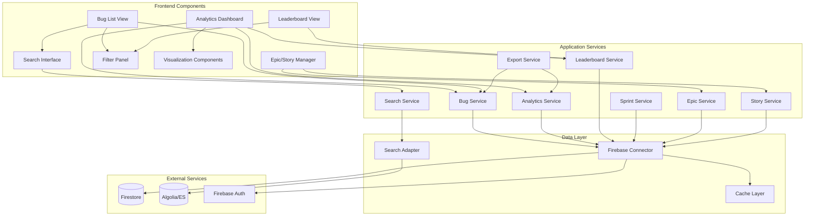

# Bug Analytics and Categorization System - Design Document

## Overview

The Bug Analytics and Categorization System is a comprehensive analytics and tracking platform integrated into the Zenit Tracker application. It provides advanced bug categorization, analytics event tracking, leaderboard functionality, sprint-based filtering, Epic/Story management, and powerful search capabilities powered by modern search infrastructure.

### Key Capabilities

- **Flexible Bug Taxonomy**: Multi-dimensional categorization (type, severity, component, custom fields)
- **Analytics Event Tracking**: Capture and categorize system events with rich metadata
- **Leaderboard System**: Identify top bug loggers across different time periods
- **Sprint Integration**: Filter and analyze data within sprint boundaries
- **Epic/Story Management**: Hierarchical work organization with completion tracking
- **Advanced Search**: Full-text search with faceting powered by Algolia or ElasticSearch
- **Time-Based Filtering**: Multiple preset ranges and custom date selection
- **Data Visualization**: Interactive charts and dashboards for trend analysis
- **Export Capabilities**: Excel, CSV, and PDF export with metadata
- **Role-Based Access Control**: Secure data access based on user roles

### Technology Stack

- **Frontend**: Next.js 14+ with App Router, React 18+, TypeScript
- **UI Components**: ShadCN UI, Tailwind CSS, Recharts for visualizations
- **Backend**: Firebase/Firestore for data persistence
- **Search**: Algolia (primary recommendation) or ElasticSearch
- **Authentication**: Firebase Authentication
- **State Management**: React Context API with custom hooks
- **Export**: SheetJS (xlsx) for Excel, jsPDF for PDF generation

## Architecture

### System Architecture

The system follows a layered architecture pattern with clear separation of concerns:

```
┌─────────────────────────────────────────────────────────────┐
│                     Presentation Layer                       │
│  (Next.js Pages, React Components, ShadCN UI)               │
└─────────────────────────────────────────────────────────────┘
                            │
┌─────────────────────────────────────────────────────────────┐
│                     Application Layer                        │
│  (Hooks, Context Providers, Business Logic)                 │
└─────────────────────────────────────────────────────────────┘
                            │
┌─────────────────────────────────────────────────────────────┐
│                      Service Layer                           │
│  (API Routes, Data Services, Search Service)                │
└─────────────────────────────────────────────────────────────┘
                            │
┌─────────────────────────────────────────────────────────────┐
│                    Integration Layer                         │
│  (Firebase Connector, Search Engine Adapter)                │
└─────────────────────────────────────────────────────────────┘
                            │
┌─────────────────────────────────────────────────────────────┐
│                     Data Layer                               │
│  (Firestore, Algolia/ElasticSearch Index)                   │
└─────────────────────────────────────────────────────────────┘
```


### Component Architecture



### Data Flow Patterns

**1. Bug Creation Flow**
```
User Input → Validation → Bug Service → Firebase Connector → Firestore
                                      ↓
                              Search Sync Service → Search Engine
```

**2. Search Query Flow**
```
Search Input → Debounce → Search Service → Search Adapter → Search Engine
                                                          ↓
                                                    Results + Facets
                                                          ↓
                                              Search UI (with highlights)
```

**3. Leaderboard Calculation Flow**
```
Time Filter Selection → Leaderboard Service → Query Firestore (with indexes)
                                           ↓
                                    Aggregate & Rank
                                           ↓
                                    Cache Results
                                           ↓
                                    Leaderboard View
```

**4. Analytics Event Flow**
```
Event Trigger → Analytics Tracker → Batch Queue → Firebase Connector → Firestore
                                                                      ↓
                                                              Search Sync (async)
```

## Components and Interfaces

### Core Components

#### 1. Bug Categorizer Component

**Location**: `src/lib/bug-categorizer.ts`

**Responsibilities**:
- Validate bug taxonomy fields
- Apply categorization rules
- Manage custom taxonomy definitions
- Persist categorization metadata

**Interface**:
```typescript
interface BugCategorizerConfig {
  requiredFields: string[];
  customTaxonomy: TaxonomyField[];
}

interface TaxonomyField {
  id: string;
  name: string;
  type: 'select' | 'multi-select' | 'text' | 'number';
  options?: string[];
  required: boolean;
  validation?: (value: any) => boolean;
}

class BugCategorizer {
  constructor(config: BugCategorizerConfig);
  
  validateCategories(bug: Partial<EnhancedBug>): ValidationResult;
  applyCategories(bug: Partial<EnhancedBug>, categories: BugCategories): EnhancedBug;
  getAvailableCategories(): CategoryDefinitions;
  addCustomField(field: TaxonomyField): void;
  removeCustomField(fieldId: string): void;
}
```


#### 2. Analytics Tracker Component

**Location**: `src/lib/analytics-tracker.ts`

**Responsibilities**:
- Capture analytics events with metadata
- Batch events for efficient storage
- Handle offline scenarios with queue
- Categorize events by domain

**Interface**:
```typescript
interface AnalyticsEvent {
  id: string;
  timestamp: Timestamp;
  eventType: string;
  domain: 'user_action' | 'system_event' | 'performance_metric' | 'error_event';
  userId: string;
  metadata: Record<string, any>;
  sessionId?: string;
}

interface AnalyticsTrackerConfig {
  batchSize: number;
  flushInterval: number; // milliseconds
  maxQueueSize: number;
}

class AnalyticsTracker {
  constructor(config: AnalyticsTrackerConfig);
  
  trackEvent(eventType: string, domain: string, metadata?: Record<string, any>): Promise<void>;
  flush(): Promise<void>;
  getQueueSize(): number;
  clearQueue(): void;
  aggregateEvents(timeRange: TimeRange, groupBy: string): Promise<AggregatedEvents>;
}
```

#### 3. Leaderboard Service Component

**Location**: `src/lib/leaderboard-service.ts`

**Responsibilities**:
- Calculate bug logger rankings
- Handle time period filtering
- Compute quality scores
- Manage tie-breaking logic

**Interface**:
```typescript
interface LeaderboardEntry {
  userId: string;
  userName: string;
  bugCount: number;
  severityDistribution: Record<BugSeverity, number>;
  qualityScore: number;
  rank: number;
}

interface LeaderboardQuery {
  timePeriod: 'current_month' | 'previous_month' | 'custom';
  startDate?: Date;
  endDate?: Date;
  limit?: number;
}

class LeaderboardService {
  calculateLeaderboard(query: LeaderboardQuery): Promise<LeaderboardEntry[]>;
  getQualityScore(userId: string, timePeriod: TimeRange): Promise<number>;
  getUserRank(userId: string, query: LeaderboardQuery): Promise<number>;
  invalidateCache(timePeriod: string): void;
}
```

#### 4. Search Service Component

**Location**: `src/lib/search-service.ts`

**Responsibilities**:
- Interface with search engine (Algolia/ES)
- Manage search indexes
- Handle search queries with facets
- Provide autocomplete suggestions

**Interface**:
```typescript
interface SearchQuery {
  query: string;
  filters?: SearchFilters;
  facets?: string[];
  page?: number;
  hitsPerPage?: number;
}

interface SearchFilters {
  category?: string[];
  severity?: string[];
  status?: string[];
  assignee?: string[];
  dateRange?: { start: Date; end: Date };
}

interface SearchResult<T> {
  hits: T[];
  totalHits: number;
  facets: Record<string, FacetValue[]>;
  processingTimeMs: number;
}

interface FacetValue {
  value: string;
  count: number;
}

class SearchService {
  constructor(adapter: SearchAdapter);
  
  search<T>(indexName: string, query: SearchQuery): Promise<SearchResult<T>>;
  autocomplete(indexName: string, query: string): Promise<string[]>;
  saveSearch(userId: string, name: string, query: SearchQuery): Promise<void>;
  getSavedSearches(userId: string): Promise<SavedSearch[]>;
  syncToIndex<T>(indexName: string, documents: T[]): Promise<void>;
  deleteFromIndex(indexName: string, documentIds: string[]): Promise<void>;
}
```


#### 5. Sprint Filter Component

**Location**: `src/lib/sprint-filter.ts`

**Responsibilities**:
- Filter data by sprint boundaries
- Manage sprint metadata
- Calculate sprint metrics
- Support multi-sprint selection

**Interface**:
```typescript
interface Sprint {
  id: string;
  name: string;
  startDate: Date;
  endDate: Date;
  goals: string[];
  status: 'planned' | 'active' | 'completed';
  teamId?: string;
}

interface SprintMetrics {
  totalBugs: number;
  resolvedBugs: number;
  averageResolutionTime: number; // hours
  bugsBySeverity: Record<BugSeverity, number>;
  velocityPoints?: number;
}

class SprintFilter {
  getActiveSprint(): Promise<Sprint | null>;
  getSprintById(sprintId: string): Promise<Sprint | null>;
  getSprintsByDateRange(start: Date, end: Date): Promise<Sprint[]>;
  filterBugsBySprint(sprintId: string): Promise<EnhancedBug[]>;
  filterAnalyticsBySprint(sprintId: string): Promise<AnalyticsEvent[]>;
  calculateSprintMetrics(sprintId: string): Promise<SprintMetrics>;
  getMultiSprintData(sprintIds: string[]): Promise<Record<string, any>>;
}
```

#### 6. Epic and Story Manager Components

**Location**: `src/lib/epic-manager.ts`, `src/lib/story-manager.ts`

**Responsibilities**:
- CRUD operations for Epics and Stories
- Manage Epic-Story relationships
- Calculate completion percentages
- Handle cascading deletes

**Interface**:
```typescript
interface Epic {
  id: string;
  title: string;
  description: string;
  status: 'backlog' | 'in_progress' | 'completed' | 'archived';
  priority: 'high' | 'medium' | 'low';
  ownerId: string;
  ownerName: string;
  storyIds: string[];
  completionPercentage: number;
  createdAt: Timestamp;
  updatedAt: Timestamp;
  targetDate?: Date;
  tags: string[];
}

interface Story {
  id: string;
  title: string;
  description: string;
  epicId: string;
  status: 'backlog' | 'in_progress' | 'in_review' | 'done' | 'blocked';
  priority: 'high' | 'medium' | 'low';
  assigneeId?: string;
  assigneeName?: string;
  storyPoints?: number;
  createdAt: Timestamp;
  updatedAt: Timestamp;
  blockedReason?: string;
  acceptanceCriteria: string[];
}

class EpicManager {
  createEpic(epic: Omit<Epic, 'id' | 'createdAt' | 'updatedAt'>): Promise<Epic>;
  updateEpic(epicId: string, updates: Partial<Epic>): Promise<void>;
  deleteEpic(epicId: string, reassignStories: boolean): Promise<void>;
  getEpicById(epicId: string): Promise<Epic | null>;
  getEpicsByStatus(status: Epic['status']): Promise<Epic[]>;
  calculateCompletion(epicId: string): Promise<number>;
  getStoriesForEpic(epicId: string): Promise<Story[]>;
}

class StoryManager {
  createStory(story: Omit<Story, 'id' | 'createdAt' | 'updatedAt'>): Promise<Story>;
  updateStory(storyId: string, updates: Partial<Story>): Promise<void>;
  deleteStory(storyId: string): Promise<void>;
  getStoryById(storyId: string): Promise<Story | null>;
  transitionStatus(storyId: string, newStatus: Story['status']): Promise<void>;
  linkToEpic(storyId: string, epicId: string): Promise<void>;
  unlinkFromEpic(storyId: string): Promise<void>;
}
```


#### 7. Time Filter Component

**Location**: `src/lib/time-filter.ts`

**Responsibilities**:
- Provide preset time ranges
- Validate custom date ranges
- Convert time ranges to Firestore queries
- Persist user's last selection

**Interface**:
```typescript
type TimePreset = 
  | 'current_month' 
  | 'previous_month' 
  | 'last_7_days' 
  | 'last_30_days' 
  | 'last_quarter' 
  | 'last_year' 
  | 'all_time'
  | 'custom';

interface TimeRange {
  start: Date;
  end: Date;
  preset?: TimePreset;
}

class TimeFilter {
  getPresetRange(preset: TimePreset): TimeRange;
  validateCustomRange(start: Date, end: Date): boolean;
  createFirestoreQuery(collectionRef: any, timeRange: TimeRange, dateField: string): any;
  saveLastSelection(userId: string, timeRange: TimeRange): void;
  getLastSelection(userId: string): TimeRange | null;
  formatRangeLabel(timeRange: TimeRange): string;
}
```

#### 8. Data Visualizer Component

**Location**: `src/components/analytics/data-visualizer.tsx`

**Responsibilities**:
- Render charts using Recharts
- Export visualizations as images/PDF
- Update charts reactively on filter changes
- Display summary metric cards

**Interface**:
```typescript
interface ChartConfig {
  type: 'pie' | 'line' | 'bar' | 'area' | 'composed';
  data: any[];
  xKey?: string;
  yKeys: string[];
  colors?: string[];
  title: string;
  height?: number;
}

interface MetricCard {
  title: string;
  value: number | string;
  change?: number; // percentage change
  trend?: 'up' | 'down' | 'neutral';
  icon?: React.ComponentType;
}

const DataVisualizer: React.FC<{
  charts: ChartConfig[];
  metrics: MetricCard[];
  onExport?: (format: 'png' | 'pdf') => void;
}>;
```

#### 9. Export Service Component

**Location**: `src/lib/export-service.ts`

**Responsibilities**:
- Export data to Excel, CSV, PDF formats
- Include metadata in exports
- Handle large dataset exports with background processing
- Generate file names with filters and timestamps

**Interface**:
```typescript
interface ExportConfig {
  format: 'excel' | 'csv' | 'pdf';
  data: any[];
  fileName: string;
  metadata?: {
    exportDate: Date;
    exportedBy: string;
    filters: Record<string, any>;
  };
  columns?: ColumnDefinition[];
}

interface ColumnDefinition {
  key: string;
  label: string;
  format?: (value: any) => string;
}

class ExportService {
  exportToExcel(config: ExportConfig): Promise<Blob>;
  exportToCSV(config: ExportConfig): Promise<Blob>;
  exportToPDF(config: ExportConfig): Promise<Blob>;
  scheduleExport(userId: string, schedule: ExportSchedule): Promise<void>;
  getScheduledExports(userId: string): Promise<ExportSchedule[]>;
  cancelScheduledExport(scheduleId: string): Promise<void>;
}

interface ExportSchedule {
  id: string;
  userId: string;
  frequency: 'daily' | 'weekly' | 'monthly';
  format: 'excel' | 'csv' | 'pdf';
  query: any;
  emailTo: string[];
  nextRunDate: Date;
}
```


#### 10. Firebase Connector Component

**Location**: `src/lib/firebase-connector.ts`

**Responsibilities**:
- Abstract Firestore operations
- Implement pagination
- Handle transactions
- Manage offline queue
- Enforce security rules

**Interface**:
```typescript
interface QueryOptions {
  limit?: number;
  orderBy?: { field: string; direction: 'asc' | 'desc' };
  where?: WhereClause[];
  startAfter?: any;
}

interface WhereClause {
  field: string;
  operator: FirebaseFirestore.WhereFilterOp;
  value: any;
}

interface PaginatedResult<T> {
  data: T[];
  lastDoc: any;
  hasMore: boolean;
}

class FirebaseConnector {
  constructor(db: Firestore);
  
  // CRUD operations
  create<T>(collection: string, data: T): Promise<string>;
  read<T>(collection: string, docId: string): Promise<T | null>;
  update<T>(collection: string, docId: string, updates: Partial<T>): Promise<void>;
  delete(collection: string, docId: string): Promise<void>;
  
  // Query operations
  query<T>(collection: string, options: QueryOptions): Promise<T[]>;
  queryPaginated<T>(collection: string, options: QueryOptions): Promise<PaginatedResult<T>>;
  
  // Transaction operations
  runTransaction<T>(callback: (transaction: any) => Promise<T>): Promise<T>;
  
  // Batch operations
  batchWrite(operations: BatchOperation[]): Promise<void>;
  
  // Offline support
  enableOfflinePersistence(): Promise<void>;
  getOfflineQueueSize(): number;
}

interface BatchOperation {
  type: 'create' | 'update' | 'delete';
  collection: string;
  docId?: string;
  data?: any;
}
```

#### 11. Search Adapter Component

**Location**: `src/lib/search-adapter.ts`

**Responsibilities**:
- Abstract search engine implementation (Algolia/ES)
- Provide unified interface for search operations
- Handle search engine failover
- Manage index synchronization

**Interface**:
```typescript
interface SearchAdapterConfig {
  provider: 'algolia' | 'elasticsearch';
  apiKey: string;
  appId?: string; // for Algolia
  endpoint?: string; // for ElasticSearch
  retryConfig?: {
    maxRetries: number;
    backoffMultiplier: number;
  };
}

abstract class SearchAdapter {
  abstract search<T>(indexName: string, query: SearchQuery): Promise<SearchResult<T>>;
  abstract indexDocuments<T>(indexName: string, documents: T[]): Promise<void>;
  abstract deleteDocuments(indexName: string, documentIds: string[]): Promise<void>;
  abstract updateDocument<T>(indexName: string, documentId: string, document: T): Promise<void>;
  abstract getAutocomplete(indexName: string, query: string): Promise<string[]>;
  abstract configureFacets(indexName: string, facets: string[]): Promise<void>;
  abstract getSearchAnalytics(indexName: string): Promise<SearchAnalytics>;
}

class AlgoliaAdapter extends SearchAdapter {
  // Algolia-specific implementation
}

class ElasticSearchAdapter extends SearchAdapter {
  // ElasticSearch-specific implementation
}

interface SearchAnalytics {
  popularQueries: Array<{ query: string; count: number }>;
  zeroResultQueries: Array<{ query: string; count: number }>;
  clickThroughRate: number;
  averageResponseTime: number;
}
```


### React Hooks

#### useAnalytics Hook

**Location**: `src/hooks/useAnalytics.ts`

```typescript
interface UseAnalyticsReturn {
  trackEvent: (eventType: string, metadata?: Record<string, any>) => Promise<void>;
  getEvents: (query: AnalyticsQuery) => Promise<AnalyticsEvent[]>;
  aggregateEvents: (timeRange: TimeRange, groupBy: string) => Promise<AggregatedEvents>;
  loading: boolean;
  error: Error | null;
}

function useAnalytics(): UseAnalyticsReturn;
```

#### useBugCategories Hook

**Location**: `src/hooks/useBugCategories.ts`

```typescript
interface UseBugCategoriesReturn {
  categories: CategoryDefinitions;
  validateBug: (bug: Partial<EnhancedBug>) => ValidationResult;
  applyCategories: (bug: Partial<EnhancedBug>, categories: BugCategories) => EnhancedBug;
  addCustomField: (field: TaxonomyField) => Promise<void>;
  loading: boolean;
}

function useBugCategories(): UseBugCategoriesReturn;
```

#### useLeaderboard Hook

**Location**: `src/hooks/useLeaderboard.ts`

```typescript
interface UseLeaderboardReturn {
  leaderboard: LeaderboardEntry[];
  loading: boolean;
  error: Error | null;
  refetch: (query: LeaderboardQuery) => Promise<void>;
  getUserRank: (userId: string) => number | null;
}

function useLeaderboard(query: LeaderboardQuery): UseLeaderboardReturn;
```

#### useSearch Hook

**Location**: `src/hooks/useSearch.ts`

```typescript
interface UseSearchReturn<T> {
  results: SearchResult<T>;
  search: (query: string, filters?: SearchFilters) => Promise<void>;
  autocomplete: (query: string) => Promise<string[]>;
  loading: boolean;
  error: Error | null;
  saveSearch: (name: string) => Promise<void>;
  savedSearches: SavedSearch[];
}

function useSearch<T>(indexName: string): UseSearchReturn<T>;
```

#### useTimeFilter Hook

**Location**: `src/hooks/useTimeFilter.ts`

```typescript
interface UseTimeFilterReturn {
  timeRange: TimeRange;
  setPreset: (preset: TimePreset) => void;
  setCustomRange: (start: Date, end: Date) => void;
  formatLabel: () => string;
  isValid: boolean;
}

function useTimeFilter(initialPreset?: TimePreset): UseTimeFilterReturn;
```

#### useExport Hook

**Location**: `src/hooks/useExport.ts`

```typescript
interface UseExportReturn {
  exportData: (config: ExportConfig) => Promise<void>;
  exporting: boolean;
  progress: number;
  error: Error | null;
}

function useExport(): UseExportReturn;
```


## Data Models

### Enhanced Bug Model

Extends the existing Bug interface with categorization and analytics fields:

```typescript
interface BugCategories {
  type: 'functional' | 'ui' | 'performance' | 'security' | 'crash' | 'data';
  severity: BugSeverity; // reuse existing
  component: 'authentication' | 'dashboard' | 'api' | 'database' | 'ui' | 'network';
  customFields: Record<string, any>;
}

interface EnhancedBug extends Bug {
  categories: BugCategories;
  tags: string[];
  sprintId?: string;
  epicId?: string;
  storyId?: string;
  searchableText?: string; // denormalized for search
  resolutionTime?: number; // hours
  reopenCount?: number;
  viewCount?: number;
  lastViewedAt?: Timestamp;
}
```

### Analytics Event Model

```typescript
interface AnalyticsEvent {
  id: string;
  timestamp: Timestamp;
  eventType: string;
  domain: 'user_action' | 'system_event' | 'performance_metric' | 'error_event';
  userId: string;
  userName?: string;
  metadata: Record<string, any>;
  sessionId?: string;
  bugId?: string;
  epicId?: string;
  storyId?: string;
  sprintId?: string;
  searchableText?: string;
}

interface AggregatedEvents {
  groupKey: string;
  count: number;
  events: AnalyticsEvent[];
  timeRange: TimeRange;
}
```

### Leaderboard Models

```typescript
interface LeaderboardEntry {
  userId: string;
  userName: string;
  photoURL?: string;
  bugCount: number;
  severityDistribution: {
    critical: number;
    high: number;
    medium: number;
    low: number;
  };
  qualityScore: number; // 0-100
  rank: number;
  averageResolutionTime?: number;
  reopenRate?: number;
}

interface LeaderboardCache {
  timePeriod: string;
  entries: LeaderboardEntry[];
  calculatedAt: Timestamp;
  expiresAt: Timestamp;
}
```

### Sprint Model

```typescript
interface Sprint {
  id: string;
  name: string;
  startDate: Timestamp;
  endDate: Timestamp;
  goals: string[];
  status: 'planned' | 'active' | 'completed';
  teamId?: string;
  teamName?: string;
  velocityTarget?: number;
  createdAt: Timestamp;
  updatedAt: Timestamp;
}

interface SprintMetrics {
  sprintId: string;
  totalBugs: number;
  resolvedBugs: number;
  openBugs: number;
  averageResolutionTime: number;
  bugsBySeverity: Record<BugSeverity, number>;
  bugsByComponent: Record<string, number>;
  velocityPoints?: number;
  burndownData: Array<{ date: Date; remaining: number }>;
}
```

### Epic and Story Models

```typescript
interface Epic {
  id: string;
  title: string;
  description: string;
  status: 'backlog' | 'in_progress' | 'completed' | 'archived';
  priority: 'high' | 'medium' | 'low';
  ownerId: string;
  ownerName: string;
  storyIds: string[];
  completionPercentage: number;
  createdAt: Timestamp;
  updatedAt: Timestamp;
  targetDate?: Timestamp;
  tags: string[];
  searchableText?: string;
}

interface Story {
  id: string;
  title: string;
  description: string;
  epicId: string;
  status: 'backlog' | 'in_progress' | 'in_review' | 'done' | 'blocked';
  priority: 'high' | 'medium' | 'low';
  assigneeId?: string;
  assigneeName?: string;
  storyPoints?: number;
  createdAt: Timestamp;
  updatedAt: Timestamp;
  blockedReason?: string;
  acceptanceCriteria: string[];
  bugIds: string[]; // linked bugs
  searchableText?: string;
}
```


### Search Index Models

```typescript
interface BugSearchDocument {
  objectID: string; // bug.id
  title: string;
  description: string;
  stepsToReproduce: string;
  type: string;
  severity: string;
  component: string;
  status: string;
  priority: string;
  platform: string;
  tags: string[];
  assignedToName?: string;
  reportedByName: string;
  createdAt: number; // timestamp
  updatedAt: number;
  sprintId?: string;
  epicId?: string;
  storyId?: string;
}

interface EpicSearchDocument {
  objectID: string;
  title: string;
  description: string;
  status: string;
  priority: string;
  ownerName: string;
  tags: string[];
  completionPercentage: number;
  createdAt: number;
  updatedAt: number;
}

interface StorySearchDocument {
  objectID: string;
  title: string;
  description: string;
  epicId: string;
  status: string;
  priority: string;
  assigneeName?: string;
  storyPoints?: number;
  createdAt: number;
  updatedAt: number;
}
```

### Saved Search Model

```typescript
interface SavedSearch {
  id: string;
  userId: string;
  name: string;
  query: SearchQuery;
  indexName: string;
  createdAt: Timestamp;
  lastUsedAt?: Timestamp;
  useCount: number;
}
```

### Export Metadata Model

```typescript
interface ExportMetadata {
  exportId: string;
  exportDate: Timestamp;
  exportedBy: string;
  exportedByName: string;
  format: 'excel' | 'csv' | 'pdf';
  recordCount: number;
  filters: {
    timeRange?: TimeRange;
    categories?: string[];
    status?: string[];
    sprint?: string;
    [key: string]: any;
  };
  fileSize?: number;
  downloadUrl?: string;
  expiresAt?: Timestamp;
}
```

### User Preferences Model

```typescript
interface UserPreferences {
  userId: string;
  lastTimeFilter?: TimeRange;
  lastSprintId?: string;
  defaultChartTypes?: Record<string, ChartConfig['type']>;
  savedSearchIds: string[];
  dashboardLayout?: any; // for future customization
  notificationSettings?: {
    leaderboardUpdates: boolean;
    sprintSummaries: boolean;
    exportCompletion: boolean;
  };
}
```

### Firestore Collections Structure

```
/bugs/{bugId}
  - Enhanced bug documents with categories

/analytics_events/{eventId}
  - Analytics event documents

/epics/{epicId}
  - Epic documents

/stories/{storyId}
  - Story documents

/sprints/{sprintId}
  - Sprint documents

/leaderboard_cache/{cacheKey}
  - Cached leaderboard results

/saved_searches/{searchId}
  - User saved searches

/user_preferences/{userId}
  - User preference documents

/export_metadata/{exportId}
  - Export job metadata

/taxonomy_config/custom_fields
  - Custom taxonomy field definitions
```


### Firestore Indexes

Required composite indexes for optimal query performance:

```javascript
// bugs collection
{
  collectionGroup: "bugs",
  queryScope: "COLLECTION",
  fields: [
    { fieldPath: "createdAt", order: "DESCENDING" },
    { fieldPath: "categories.severity", order: "ASCENDING" }
  ]
}

{
  collectionGroup: "bugs",
  queryScope: "COLLECTION",
  fields: [
    { fieldPath: "sprintId", order: "ASCENDING" },
    { fieldPath: "status", order: "ASCENDING" },
    { fieldPath: "createdAt", order: "DESCENDING" }
  ]
}

{
  collectionGroup: "bugs",
  queryScope: "COLLECTION",
  fields: [
    { fieldPath: "reportedByUid", order: "ASCENDING" },
    { fieldPath: "createdAt", order: "DESCENDING" }
  ]
}

// analytics_events collection
{
  collectionGroup: "analytics_events",
  queryScope: "COLLECTION",
  fields: [
    { fieldPath: "domain", order: "ASCENDING" },
    { fieldPath: "timestamp", order: "DESCENDING" }
  ]
}

{
  collectionGroup: "analytics_events",
  queryScope: "COLLECTION",
  fields: [
    { fieldPath: "userId", order: "ASCENDING" },
    { fieldPath: "timestamp", order: "DESCENDING" }
  ]
}

// stories collection
{
  collectionGroup: "stories",
  queryScope: "COLLECTION",
  fields: [
    { fieldPath: "epicId", order: "ASCENDING" },
    { fieldPath: "status", order: "ASCENDING" }
  ]
}
```

## API Design

### REST API Endpoints

The system will use Next.js API routes for server-side operations:

#### Bug Analytics Endpoints

```
GET    /api/analytics/bugs/distribution
       Query params: timeRange, groupBy (severity|component|type)
       Returns: Distribution data for charts

GET    /api/analytics/bugs/trends
       Query params: timeRange, interval (day|week|month)
       Returns: Time-series data for trend charts

GET    /api/analytics/bugs/summary
       Query params: timeRange, sprintId
       Returns: Summary metrics (total, open, resolved, avg resolution time)
```

#### Leaderboard Endpoints

```
GET    /api/leaderboard
       Query params: timePeriod, limit
       Returns: Ranked list of bug loggers

GET    /api/leaderboard/user/:userId
       Query params: timePeriod
       Returns: Specific user's rank and stats
```

#### Sprint Endpoints

```
GET    /api/sprints
       Query params: status, teamId
       Returns: List of sprints

GET    /api/sprints/:sprintId
       Returns: Sprint details

GET    /api/sprints/:sprintId/metrics
       Returns: Sprint metrics and burndown data

POST   /api/sprints
       Body: Sprint data
       Returns: Created sprint

PUT    /api/sprints/:sprintId
       Body: Sprint updates
       Returns: Updated sprint
```

#### Epic and Story Endpoints

```
GET    /api/epics
       Query params: status, priority
       Returns: List of epics

GET    /api/epics/:epicId
       Returns: Epic details with linked stories

POST   /api/epics
       Body: Epic data
       Returns: Created epic

PUT    /api/epics/:epicId
       Body: Epic updates
       Returns: Updated epic

DELETE /api/epics/:epicId
       Query params: reassignStories (boolean)
       Returns: Success status

GET    /api/stories
       Query params: epicId, status, assigneeId
       Returns: List of stories

GET    /api/stories/:storyId
       Returns: Story details

POST   /api/stories
       Body: Story data
       Returns: Created story

PUT    /api/stories/:storyId
       Body: Story updates
       Returns: Updated story

DELETE /api/stories/:storyId
       Returns: Success status
```


#### Search Endpoints

```
GET    /api/search
       Query params: q (query), index, filters, facets, page, hitsPerPage
       Returns: Search results with facets

GET    /api/search/autocomplete
       Query params: q (query), index
       Returns: Autocomplete suggestions

POST   /api/search/sync
       Body: { index, documentIds }
       Returns: Sync status
       Note: Triggered automatically on document changes

GET    /api/search/saved
       Returns: User's saved searches

POST   /api/search/saved
       Body: { name, query, index }
       Returns: Created saved search

DELETE /api/search/saved/:searchId
       Returns: Success status
```

#### Export Endpoints

```
POST   /api/export
       Body: ExportConfig
       Returns: Export job ID or direct download (for small datasets)

GET    /api/export/:exportId/status
       Returns: Export job status and progress

GET    /api/export/:exportId/download
       Returns: File download

GET    /api/export/scheduled
       Returns: User's scheduled exports

POST   /api/export/scheduled
       Body: ExportSchedule
       Returns: Created schedule

DELETE /api/export/scheduled/:scheduleId
       Returns: Success status
```

#### Analytics Event Endpoints

```
POST   /api/analytics/track
       Body: { eventType, domain, metadata }
       Returns: Success status

POST   /api/analytics/batch
       Body: { events: AnalyticsEvent[] }
       Returns: Success status

GET    /api/analytics/aggregate
       Query params: timeRange, groupBy, domain
       Returns: Aggregated event data
```

### Search Engine Integration

#### Algolia Configuration

```typescript
// Algolia index settings
const bugIndexSettings = {
  searchableAttributes: [
    'title',
    'description',
    'stepsToReproduce',
    'tags',
    'reportedByName'
  ],
  attributesForFaceting: [
    'filterOnly(type)',
    'filterOnly(severity)',
    'filterOnly(component)',
    'filterOnly(status)',
    'filterOnly(priority)',
    'searchable(tags)',
    'filterOnly(sprintId)'
  ],
  customRanking: [
    'desc(createdAt)',
    'desc(severity)'
  ],
  typoTolerance: true,
  minWordSizefor1Typo: 4,
  minWordSizefor2Typos: 8,
  hitsPerPage: 20,
  maxValuesPerFacet: 100
};
```

#### ElasticSearch Configuration

```typescript
// ElasticSearch index mapping
const bugIndexMapping = {
  properties: {
    title: { type: 'text', analyzer: 'standard' },
    description: { type: 'text', analyzer: 'standard' },
    stepsToReproduce: { type: 'text', analyzer: 'standard' },
    type: { type: 'keyword' },
    severity: { type: 'keyword' },
    component: { type: 'keyword' },
    status: { type: 'keyword' },
    priority: { type: 'keyword' },
    platform: { type: 'keyword' },
    tags: { type: 'keyword' },
    assignedToName: { type: 'keyword' },
    reportedByName: { type: 'keyword' },
    createdAt: { type: 'date' },
    updatedAt: { type: 'date' },
    sprintId: { type: 'keyword' },
    epicId: { type: 'keyword' },
    storyId: { type: 'keyword' }
  }
};

// ElasticSearch query template
const searchQuery = {
  query: {
    bool: {
      must: [
        {
          multi_match: {
            query: '{{query}}',
            fields: ['title^3', 'description^2', 'stepsToReproduce', 'tags'],
            fuzziness: 'AUTO'
          }
        }
      ],
      filter: [] // populated with facet filters
    }
  },
  aggs: {
    severity: { terms: { field: 'severity' } },
    component: { terms: { field: 'component' } },
    status: { terms: { field: 'status' } }
  },
  highlight: {
    fields: {
      title: {},
      description: {},
      stepsToReproduce: {}
    }
  }
};
```


### Search Synchronization Strategy

**Real-time Sync Approach**:

1. **Firestore Triggers**: Use Cloud Functions or client-side listeners to detect document changes
2. **Sync Queue**: Batch updates to search index every 5 seconds or when queue reaches 10 items
3. **Retry Logic**: Exponential backoff for failed sync operations
4. **Fallback**: If search is unavailable, fall back to Firestore queries with limited functionality

```typescript
// Sync service implementation
class SearchSyncService {
  private queue: SyncOperation[] = [];
  private syncInterval: NodeJS.Timeout | null = null;
  
  constructor(private searchAdapter: SearchAdapter) {
    this.startSyncLoop();
  }
  
  async onDocumentChange(collection: string, docId: string, operation: 'create' | 'update' | 'delete', data?: any) {
    this.queue.push({ collection, docId, operation, data, timestamp: Date.now() });
    
    if (this.queue.length >= 10) {
      await this.flush();
    }
  }
  
  private startSyncLoop() {
    this.syncInterval = setInterval(() => {
      if (this.queue.length > 0) {
        this.flush();
      }
    }, 5000);
  }
  
  private async flush() {
    const operations = [...this.queue];
    this.queue = [];
    
    try {
      await this.processBatch(operations);
    } catch (error) {
      console.error('Search sync failed:', error);
      // Re-queue with exponential backoff
      this.queue.push(...operations);
    }
  }
  
  private async processBatch(operations: SyncOperation[]) {
    const grouped = this.groupByCollection(operations);
    
    for (const [collection, ops] of Object.entries(grouped)) {
      const indexName = this.getIndexName(collection);
      
      const creates = ops.filter(o => o.operation === 'create' || o.operation === 'update');
      const deletes = ops.filter(o => o.operation === 'delete');
      
      if (creates.length > 0) {
        const documents = creates.map(o => this.transformToSearchDoc(collection, o.data));
        await this.searchAdapter.indexDocuments(indexName, documents);
      }
      
      if (deletes.length > 0) {
        await this.searchAdapter.deleteDocuments(indexName, deletes.map(o => o.docId));
      }
    }
  }
  
  private transformToSearchDoc(collection: string, data: any): any {
    // Transform Firestore document to search document format
    switch (collection) {
      case 'bugs':
        return this.transformBugToSearchDoc(data);
      case 'epics':
        return this.transformEpicToSearchDoc(data);
      case 'stories':
        return this.transformStoryToSearchDoc(data);
      default:
        return data;
    }
  }
}
```

## Integration Patterns

### Firebase Authentication Integration

```typescript
// Auth context integration
const AnalyticsAuthGuard: React.FC<{ children: React.ReactNode; requiredRole?: UserRole }> = ({ 
  children, 
  requiredRole 
}) => {
  const { user, loading } = useAuth();
  const router = useRouter();
  
  useEffect(() => {
    if (!loading && !user) {
      router.push('/login');
    }
    
    if (!loading && user && requiredRole) {
      if (!hasRole(user, requiredRole)) {
        router.push('/unauthorized');
      }
    }
  }, [user, loading, requiredRole]);
  
  if (loading) return <LoadingSpinner />;
  if (!user) return null;
  if (requiredRole && !hasRole(user, requiredRole)) return null;
  
  return <>{children}</>;
};

// Role checking
function hasRole(user: UserProfile, requiredRole: UserRole): boolean {
  const roleHierarchy = {
    viewer: 0,
    developer: 1,
    manager: 2,
    admin: 3
  };
  
  return roleHierarchy[user.role] >= roleHierarchy[requiredRole];
}
```

### Firestore Security Rules

```javascript
rules_version = '2';
service cloud.firestore {
  match /databases/{database}/documents {
    
    // Helper functions
    function isAuthenticated() {
      return request.auth != null;
    }
    
    function getUserRole() {
      return get(/databases/$(database)/documents/users/$(request.auth.uid)).data.role;
    }
    
    function isAdmin() {
      return isAuthenticated() && getUserRole() == 'admin';
    }
    
    function isManagerOrAdmin() {
      return isAuthenticated() && getUserRole() in ['manager', 'admin'];
    }
    
    // Bugs collection
    match /bugs/{bugId} {
      allow read: if isAuthenticated();
      allow create: if isAuthenticated();
      allow update: if isAuthenticated() && 
        (request.auth.uid == resource.data.reportedByUid || isManagerOrAdmin());
      allow delete: if isManagerOrAdmin();
    }
    
    // Analytics events collection
    match /analytics_events/{eventId} {
      allow read: if isAuthenticated();
      allow create: if isAuthenticated();
      allow update, delete: if isAdmin();
    }
    
    // Epics collection
    match /epics/{epicId} {
      allow read: if isAuthenticated();
      allow create, update, delete: if isManagerOrAdmin();
    }
    
    // Stories collection
    match /stories/{storyId} {
      allow read: if isAuthenticated();
      allow create, update: if isAuthenticated();
      allow delete: if isManagerOrAdmin();
    }
    
    // Sprints collection
    match /sprints/{sprintId} {
      allow read: if isAuthenticated();
      allow create, update, delete: if isManagerOrAdmin();
    }
    
    // Saved searches
    match /saved_searches/{searchId} {
      allow read, write: if isAuthenticated() && 
        request.auth.uid == resource.data.userId;
    }
    
    // User preferences
    match /user_preferences/{userId} {
      allow read, write: if isAuthenticated() && 
        request.auth.uid == userId;
    }
    
    // Leaderboard cache (read-only for users)
    match /leaderboard_cache/{cacheKey} {
      allow read: if isAuthenticated();
      allow write: if false; // Only server can write
    }
  }
}
```


### Cache Strategy

```typescript
// Multi-layer caching approach
class CacheLayer {
  private memoryCache: Map<string, CacheEntry> = new Map();
  private readonly TTL = {
    leaderboard: 5 * 60 * 1000, // 5 minutes
    sprintMetrics: 10 * 60 * 1000, // 10 minutes
    searchResults: 2 * 60 * 1000, // 2 minutes
    userPreferences: 30 * 60 * 1000 // 30 minutes
  };
  
  async get<T>(key: string, type: keyof typeof this.TTL): Promise<T | null> {
    // Check memory cache first
    const cached = this.memoryCache.get(key);
    if (cached && Date.now() < cached.expiresAt) {
      return cached.data as T;
    }
    
    // Check localStorage for persistent cache
    if (typeof window !== 'undefined') {
      const stored = localStorage.getItem(`cache_${key}`);
      if (stored) {
        const parsed = JSON.parse(stored);
        if (Date.now() < parsed.expiresAt) {
          this.memoryCache.set(key, parsed);
          return parsed.data as T;
        }
      }
    }
    
    return null;
  }
  
  async set<T>(key: string, data: T, type: keyof typeof this.TTL): Promise<void> {
    const entry: CacheEntry = {
      data,
      expiresAt: Date.now() + this.TTL[type]
    };
    
    this.memoryCache.set(key, entry);
    
    if (typeof window !== 'undefined') {
      localStorage.setItem(`cache_${key}`, JSON.stringify(entry));
    }
  }
  
  invalidate(pattern: string): void {
    // Invalidate matching keys
    for (const key of this.memoryCache.keys()) {
      if (key.includes(pattern)) {
        this.memoryCache.delete(key);
        if (typeof window !== 'undefined') {
          localStorage.removeItem(`cache_${key}`);
        }
      }
    }
  }
}

interface CacheEntry {
  data: any;
  expiresAt: number;
}
```

## Error Handling

### Error Types and Handling Strategy

```typescript
// Custom error classes
class BugAnalyticsError extends Error {
  constructor(
    message: string,
    public code: string,
    public statusCode: number = 500,
    public details?: any
  ) {
    super(message);
    this.name = 'BugAnalyticsError';
  }
}

class ValidationError extends BugAnalyticsError {
  constructor(message: string, details?: any) {
    super(message, 'VALIDATION_ERROR', 400, details);
    this.name = 'ValidationError';
  }
}

class AuthorizationError extends BugAnalyticsError {
  constructor(message: string = 'Unauthorized access') {
    super(message, 'AUTHORIZATION_ERROR', 403);
    this.name = 'AuthorizationError';
  }
}

class SearchEngineError extends BugAnalyticsError {
  constructor(message: string, details?: any) {
    super(message, 'SEARCH_ENGINE_ERROR', 503, details);
    this.name = 'SearchEngineError';
  }
}

class FirestoreError extends BugAnalyticsError {
  constructor(message: string, details?: any) {
    super(message, 'FIRESTORE_ERROR', 500, details);
    this.name = 'FirestoreError';
  }
}

// Global error handler
class ErrorHandler {
  static handle(error: Error, context?: string): void {
    console.error(`[${context || 'Unknown'}]`, error);
    
    // Log to analytics
    if (typeof window !== 'undefined') {
      const analyticsTracker = new AnalyticsTracker({
        batchSize: 10,
        flushInterval: 5000,
        maxQueueSize: 100
      });
      
      analyticsTracker.trackEvent('error', 'error_event', {
        errorName: error.name,
        errorMessage: error.message,
        context,
        stack: error.stack
      });
    }
    
    // Show user-friendly message
    if (error instanceof ValidationError) {
      toast.error('Validation Error', { description: error.message });
    } else if (error instanceof AuthorizationError) {
      toast.error('Access Denied', { description: error.message });
    } else if (error instanceof SearchEngineError) {
      toast.error('Search Unavailable', { 
        description: 'Search is temporarily unavailable. Please try again later.' 
      });
    } else {
      toast.error('An Error Occurred', { 
        description: 'Something went wrong. Please try again.' 
      });
    }
  }
  
  static async withRetry<T>(
    fn: () => Promise<T>,
    maxRetries: number = 3,
    backoffMs: number = 1000
  ): Promise<T> {
    let lastError: Error;
    
    for (let i = 0; i < maxRetries; i++) {
      try {
        return await fn();
      } catch (error) {
        lastError = error as Error;
        if (i < maxRetries - 1) {
          await new Promise(resolve => setTimeout(resolve, backoffMs * Math.pow(2, i)));
        }
      }
    }
    
    throw lastError!;
  }
}
```

### Fallback Strategies

**Search Engine Fallback**:
When search engine is unavailable, fall back to Firestore queries with limited functionality:

```typescript
class SearchServiceWithFallback {
  constructor(
    private searchAdapter: SearchAdapter,
    private firebaseConnector: FirebaseConnector
  ) {}
  
  async search<T>(indexName: string, query: SearchQuery): Promise<SearchResult<T>> {
    try {
      return await this.searchAdapter.search<T>(indexName, query);
    } catch (error) {
      console.warn('Search engine unavailable, falling back to Firestore');
      return await this.fallbackSearch<T>(indexName, query);
    }
  }
  
  private async fallbackSearch<T>(indexName: string, query: SearchQuery): Promise<SearchResult<T>> {
    const collection = this.getCollectionName(indexName);
    const whereClause: WhereClause[] = [];
    
    // Apply filters (limited compared to search engine)
    if (query.filters?.status) {
      whereClause.push({ field: 'status', operator: 'in', value: query.filters.status });
    }
    
    if (query.filters?.severity) {
      whereClause.push({ field: 'severity', operator: 'in', value: query.filters.severity });
    }
    
    const results = await this.firebaseConnector.query<T>(collection, {
      where: whereClause,
      limit: query.hitsPerPage || 20,
      orderBy: { field: 'createdAt', direction: 'desc' }
    });
    
    // Client-side text filtering (not ideal but works as fallback)
    const filtered = query.query 
      ? results.filter(item => this.matchesQuery(item, query.query))
      : results;
    
    return {
      hits: filtered,
      totalHits: filtered.length,
      facets: {},
      processingTimeMs: 0
    };
  }
  
  private matchesQuery(item: any, query: string): boolean {
    const searchableFields = ['title', 'description', 'tags'];
    const lowerQuery = query.toLowerCase();
    
    return searchableFields.some(field => {
      const value = item[field];
      if (typeof value === 'string') {
        return value.toLowerCase().includes(lowerQuery);
      }
      if (Array.isArray(value)) {
        return value.some(v => String(v).toLowerCase().includes(lowerQuery));
      }
      return false;
    });
  }
}
```


## Correctness Properties

A property is a characteristic or behavior that should hold true across all valid executions of a system—essentially, a formal statement about what the system should do. Properties serve as the bridge between human-readable specifications and machine-verifiable correctness guarantees.

### Property 1: Bug Categorization Completeness

For any bug with valid categorization data (type, severity, component), when the bug is saved and retrieved from Firestore, all categorization fields should be preserved exactly as they were set.

**Validates: Requirements 1.1, 1.2, 1.3, 1.7**

### Property 2: Custom Taxonomy Field Support

For any custom taxonomy field added by an administrator, bugs should be able to store values for that field, and those values should be retrievable after persistence.

**Validates: Requirements 1.4**

### Property 3: Required Field Validation

For any bug missing required taxonomy fields, validation should fail and prevent the bug from being created. For any bug with all required fields populated, validation should succeed.

**Validates: Requirements 1.5**

### Property 4: Multiple Tags Support

For any bug with multiple tags (including zero tags), all tags should be preserved when the bug is saved and retrieved.

**Validates: Requirements 1.6**

### Property 5: Analytics Event Structure

For any captured analytics event, it should contain all required fields: timestamp, eventType, domain, userId, and metadata.

**Validates: Requirements 2.1**

### Property 6: Analytics Event Domain Categorization

For any analytics event with a valid domain value (user_action, system_event, performance_metric, error_event), the event should be stored with that domain and be retrievable by domain filter.

**Validates: Requirements 2.2**

### Property 7: Custom Event Metadata Preservation

For any analytics event with arbitrary metadata key-value pairs, all metadata should be preserved when the event is stored and retrieved.

**Validates: Requirements 2.4**

### Property 8: Event Aggregation Accuracy

For any set of analytics events grouped by time period and category, the aggregated count should equal the number of events matching those criteria.

**Validates: Requirements 2.6**

### Property 9: Leaderboard Ranking Consistency

For any time period, users with more bugs logged should rank higher than users with fewer bugs logged, and users with equal bug counts should have the same rank.

**Validates: Requirements 3.3, 3.6**

### Property 10: Leaderboard Entry Completeness

For any user in the leaderboard, their entry should contain bugCount, severityDistribution, qualityScore, and rank fields.

**Validates: Requirements 3.4**

### Property 11: Deleted Bug Exclusion

For any leaderboard calculation, bugs marked as deleted or archived should not contribute to any user's bug count or quality score.

**Validates: Requirements 3.7**

### Property 12: Sprint Date Range Filtering

For any sprint with defined start and end dates, filtering bugs or analytics by that sprint should return only items with timestamps within the sprint's date range (inclusive).

**Validates: Requirements 4.3**

### Property 13: Multi-Sprint Filtering

For any set of selected sprints, the filtered results should include all bugs and analytics from any of the selected sprints (union operation).

**Validates: Requirements 4.4**

### Property 14: Sprint Metrics Calculation

For any sprint, the calculated metrics (total bugs, resolved bugs, average resolution time) should match the actual values computed from bugs within that sprint's date range.

**Validates: Requirements 4.5**

### Property 15: Sprint Selection Persistence

For any user's sprint selection saved to local storage, retrieving it should return the same sprint ID that was saved.

**Validates: Requirements 4.6**

### Property 16: Epic CRUD Operations

For any epic, creating it should make it retrievable by ID, updating it should persist changes, and deleting it should make it no longer retrievable.

**Validates: Requirements 5.1**

### Property 17: Story CRUD Operations

For any story, creating it should make it retrievable by ID, updating it should persist changes, and deleting it should make it no longer retrievable.

**Validates: Requirements 5.2**

### Property 18: Epic-Story Relationship Integrity

For any story linked to an epic, the epic's storyIds array should contain that story's ID, and querying the epic should return that story in its associated stories list.

**Validates: Requirements 5.3, 5.4**

### Property 19: Epic Completion Calculation

For any epic with linked stories, the completion percentage should equal (number of stories with status 'done' / total number of stories) * 100.

**Validates: Requirements 5.5**

### Property 20: Story Status Transitions

For any story, transitioning its status to a valid state (backlog, in_progress, in_review, done, blocked) should update the status field to that value.

**Validates: Requirements 5.6**

### Property 21: Full-Text Search Coverage

For any document containing a search query term in its title, description, or searchable text fields, that document should appear in the search results for that query.

**Validates: Requirements 6.2**

### Property 22: Faceted Search Filtering

For any search with facet filters applied (e.g., severity=critical, status=open), all returned results should match all applied filters.

**Validates: Requirements 6.3**

### Property 23: Boolean Search Operators

For any search query using AND, OR, or NOT operators, the results should correctly reflect the boolean logic (AND requires all terms, OR requires any term, NOT excludes terms).

**Validates: Requirements 6.6**

### Property 24: Search Result Highlighting

For any search result, if the query term appears in the document, the result should include highlighting information indicating where the term was found.

**Validates: Requirements 6.7**

### Property 25: Autocomplete Relevance

For any partial search query, the autocomplete suggestions should be strings that start with or contain the query text.

**Validates: Requirements 6.8**

### Property 26: Saved Search Persistence

For any saved search query, retrieving it by ID should return the same query parameters that were saved.

**Validates: Requirements 6.9**

### Property 27: Custom Date Range Validation

For any custom date range where the end date is before the start date, validation should fail and prevent the filter from being applied.

**Validates: Requirements 7.7**

### Property 28: Visualization Export Format

For any chart exported as PNG or PDF, the resulting file should be in the correct format and be openable by standard viewers.

**Validates: Requirements 8.5**

### Property 29: Summary Metrics Accuracy

For any dataset, the calculated summary metrics (total bugs, open bugs, resolution rate, average time to resolve) should match the actual values computed from the data.

**Validates: Requirements 8.7**

### Property 30: Search Index Synchronization

For any bug, epic, or story created or updated in Firestore, the corresponding document in the search index should reflect the same data after synchronization completes.

**Validates: Requirements 9.2**

### Property 31: Search Analytics Recording

For any search query performed, the search analytics should record that query and increment its count.

**Validates: Requirements 9.5**

### Property 32: Typo Tolerance

For any search query with minor typos (1-2 character differences), the search should still return relevant results that match the intended query.

**Validates: Requirements 9.6**

### Property 33: Pagination Consistency

For any paginated query with page size N, each page should contain at most N items, and iterating through all pages should return all matching items exactly once.

**Validates: Requirements 10.7**

### Property 34: Excel Export Data Integrity

For any bug list exported to Excel format, parsing the Excel file should yield the same bug data that was exported (round-trip property).

**Validates: Requirements 13.1**

### Property 35: CSV Export Data Integrity

For any analytics data exported to CSV format, parsing the CSV file should yield the same data that was exported (round-trip property).

**Validates: Requirements 13.2**

### Property 36: PDF Export Validity

For any dashboard visualization exported to PDF, the resulting file should be a valid PDF that can be opened by standard PDF readers.

**Validates: Requirements 13.3**

### Property 37: Export Filename Metadata

For any export with applied filters and date ranges, the generated filename should contain identifiable information about those filters and the date range.

**Validates: Requirements 13.4**

### Property 38: Export Metadata Completeness

For any completed export, the export metadata should include exportDate, exportedBy, exportedByName, format, recordCount, and appliedFilters.

**Validates: Requirements 13.7**

### Property 39: Role-Based Epic Creation Authorization

For any user with role 'admin' or 'manager', epic creation should succeed. For any user with role 'developer' or 'viewer', epic creation should fail with an authorization error.

**Validates: Requirements 14.2**

### Property 40: Dashboard Access Authorization

For any authenticated user (regardless of role), accessing the analytics dashboard should succeed.

**Validates: Requirements 14.3**

### Property 41: Role-Based Export Authorization

For any user with role 'admin' or 'manager', data export should succeed. For any user with role 'developer' or 'viewer', data export should fail with an authorization error.

**Validates: Requirements 14.4**

### Property 42: Audit Logging for Sensitive Access

For any access to sensitive analytics data, an audit log entry should be created containing the userId, timestamp, resource accessed, and action performed.

**Validates: Requirements 14.5**

### Property 43: Unauthorized Access Logging

For any unauthorized access attempt, the system should log the attempt with userId, timestamp, attempted resource, and action, and return an authorization error to the user.

**Validates: Requirements 14.6**


## Testing Strategy

### Dual Testing Approach

The Bug Analytics and Categorization System will employ both unit testing and property-based testing to ensure comprehensive coverage and correctness:

- **Unit Tests**: Verify specific examples, edge cases, error conditions, and integration points between components
- **Property Tests**: Verify universal properties across all inputs through randomized testing

Both testing approaches are complementary and necessary. Unit tests catch concrete bugs in specific scenarios, while property tests verify general correctness across a wide range of inputs.

### Property-Based Testing

**Library Selection**: We will use **fast-check** for TypeScript/JavaScript property-based testing, as it integrates well with Jest and provides excellent TypeScript support.

**Configuration**:
- Minimum 100 iterations per property test (due to randomization)
- Each property test must reference its design document property
- Tag format: `Feature: bug-analytics-categorization-system, Property {number}: {property_text}`

**Example Property Test**:

```typescript
import fc from 'fast-check';
import { BugCategorizer } from '@/lib/bug-categorizer';
import { FirebaseConnector } from '@/lib/firebase-connector';

describe('Bug Categorization Properties', () => {
  // Feature: bug-analytics-categorization-system, Property 1: Bug Categorization Completeness
  it('should preserve all categorization fields through save/retrieve cycle', async () => {
    await fc.assert(
      fc.asyncProperty(
        fc.record({
          type: fc.constantFrom('functional', 'ui', 'performance', 'security', 'crash', 'data'),
          severity: fc.constantFrom('critical', 'high', 'medium', 'low', 'trivial'),
          component: fc.constantFrom('authentication', 'dashboard', 'api', 'database', 'ui', 'network'),
          customFields: fc.dictionary(fc.string(), fc.anything())
        }),
        async (categories) => {
          const bug = {
            title: 'Test Bug',
            description: 'Test Description',
            categories,
            // ... other required fields
          };
          
          const bugId = await firebaseConnector.create('bugs', bug);
          const retrieved = await firebaseConnector.read('bugs', bugId);
          
          expect(retrieved.categories).toEqual(categories);
        }
      ),
      { numRuns: 100 }
    );
  });
  
  // Feature: bug-analytics-categorization-system, Property 3: Required Field Validation
  it('should fail validation for bugs missing required fields', async () => {
    await fc.assert(
      fc.asyncProperty(
        fc.record({
          title: fc.option(fc.string(), { nil: undefined }),
          severity: fc.option(fc.constantFrom('critical', 'high', 'medium', 'low'), { nil: undefined }),
          type: fc.option(fc.constantFrom('functional', 'ui', 'performance'), { nil: undefined })
        }),
        async (partialBug) => {
          const hasAllRequired = partialBug.title && partialBug.severity && partialBug.type;
          const categorizer = new BugCategorizer({ requiredFields: ['title', 'severity', 'type'], customTaxonomy: [] });
          const result = categorizer.validateCategories(partialBug);
          
          if (hasAllRequired) {
            expect(result.isValid).toBe(true);
          } else {
            expect(result.isValid).toBe(false);
          }
        }
      ),
      { numRuns: 100 }
    );
  });
});
```

### Unit Testing

**Framework**: Jest with React Testing Library for component tests

**Coverage Areas**:
- Specific examples of bug categorization (e.g., critical security bug in authentication component)
- Edge cases (empty tags array, zero bugs in sprint, epic with no stories)
- Error conditions (network failures, invalid input, unauthorized access)
- Integration points (Firebase connector with Firestore, search adapter with Algolia)
- UI interactions (filter selection, chart rendering, export button clicks)

**Example Unit Tests**:

```typescript
describe('LeaderboardService', () => {
  it('should calculate leaderboard for current month', async () => {
    const service = new LeaderboardService();
    const leaderboard = await service.calculateLeaderboard({ 
      timePeriod: 'current_month' 
    });
    
    expect(leaderboard).toBeDefined();
    expect(leaderboard.length).toBeGreaterThan(0);
    expect(leaderboard[0].rank).toBe(1);
  });
  
  it('should handle empty dataset gracefully', async () => {
    const service = new LeaderboardService();
    const leaderboard = await service.calculateLeaderboard({ 
      timePeriod: 'previous_month' 
    });
    
    expect(leaderboard).toEqual([]);
  });
  
  it('should assign same rank to tied users', async () => {
    // Create test data with tied users
    const service = new LeaderboardService();
    const leaderboard = await service.calculateLeaderboard({ 
      timePeriod: 'current_month' 
    });
    
    const tiedUsers = leaderboard.filter(entry => entry.bugCount === 5);
    const ranks = new Set(tiedUsers.map(u => u.rank));
    
    expect(ranks.size).toBe(1); // All tied users should have same rank
  });
});

describe('SearchService', () => {
  it('should return results matching search query', async () => {
    const service = new SearchService(algoliaAdapter);
    const results = await service.search('bugs', { 
      query: 'authentication error' 
    });
    
    expect(results.hits.length).toBeGreaterThan(0);
    results.hits.forEach(hit => {
      const text = `${hit.title} ${hit.description}`.toLowerCase();
      expect(text).toMatch(/authentication|error/);
    });
  });
  
  it('should apply facet filters correctly', async () => {
    const service = new SearchService(algoliaAdapter);
    const results = await service.search('bugs', { 
      query: '',
      filters: { severity: ['critical'], status: ['open'] }
    });
    
    results.hits.forEach(hit => {
      expect(hit.severity).toBe('critical');
      expect(hit.status).toBe('open');
    });
  });
});
```

### Integration Testing

**Scope**: Test interactions between major components

**Key Integration Tests**:
1. Bug creation → Search index synchronization → Search retrieval
2. Sprint filter selection → Dashboard metrics update → Chart re-rendering
3. Leaderboard calculation → Cache storage → Cache retrieval
4. Export request → Background processing → Download delivery
5. Epic deletion → Story reassignment → Database consistency

**Example Integration Test**:

```typescript
describe('Bug to Search Integration', () => {
  it('should sync new bug to search index and make it searchable', async () => {
    const bugService = new BugService(firebaseConnector);
    const searchService = new SearchService(algoliaAdapter);
    const syncService = new SearchSyncService(algoliaAdapter);
    
    // Create bug
    const bug = {
      title: 'Critical authentication failure',
      description: 'Users cannot log in',
      categories: { type: 'security', severity: 'critical', component: 'authentication' },
      // ... other fields
    };
    
    const bugId = await bugService.createBug(bug);
    
    // Trigger sync
    await syncService.onDocumentChange('bugs', bugId, 'create', bug);
    await syncService.flush();
    
    // Wait for index to update
    await new Promise(resolve => setTimeout(resolve, 2000));
    
    // Search for bug
    const results = await searchService.search('bugs', { 
      query: 'authentication failure' 
    });
    
    const foundBug = results.hits.find(hit => hit.objectID === bugId);
    expect(foundBug).toBeDefined();
    expect(foundBug.title).toBe(bug.title);
  });
});
```

### End-to-End Testing

**Framework**: Playwright for E2E tests

**Key User Flows**:
1. User logs in → Views dashboard → Applies filters → Exports data
2. Manager creates epic → Creates stories → Links stories to epic → Views completion
3. User searches for bugs → Applies facets → Saves search → Uses saved search later
4. User views leaderboard → Changes time period → Sees updated rankings
5. Admin adds custom taxonomy field → User creates bug with custom field → Field is searchable

### Performance Testing

**Tools**: Lighthouse for frontend performance, custom scripts for backend load testing

**Performance Benchmarks**:
- Dashboard initial load: < 3 seconds
- Search query response: < 300ms
- Leaderboard calculation: < 2 seconds
- Export generation (1000 records): < 5 seconds
- Chart rendering: < 500ms

### Test Data Generation

**Strategy**: Use factories and fixtures for consistent test data

```typescript
// Test data factories
class BugFactory {
  static create(overrides?: Partial<EnhancedBug>): EnhancedBug {
    return {
      id: faker.datatype.uuid(),
      title: faker.lorem.sentence(),
      description: faker.lorem.paragraph(),
      categories: {
        type: faker.helpers.arrayElement(['functional', 'ui', 'performance', 'security', 'crash', 'data']),
        severity: faker.helpers.arrayElement(['critical', 'high', 'medium', 'low', 'trivial']),
        component: faker.helpers.arrayElement(['authentication', 'dashboard', 'api', 'database', 'ui', 'network']),
        customFields: {}
      },
      tags: faker.helpers.arrayElements(['bug', 'regression', 'enhancement'], 2),
      status: 'open',
      priority: 'P2',
      reportedByUid: faker.datatype.uuid(),
      reportedByName: faker.name.fullName(),
      createdAt: Timestamp.now(),
      updatedAt: Timestamp.now(),
      ...overrides
    };
  }
  
  static createMany(count: number, overrides?: Partial<EnhancedBug>): EnhancedBug[] {
    return Array.from({ length: count }, () => this.create(overrides));
  }
}

class AnalyticsEventFactory {
  static create(overrides?: Partial<AnalyticsEvent>): AnalyticsEvent {
    return {
      id: faker.datatype.uuid(),
      timestamp: Timestamp.now(),
      eventType: faker.helpers.arrayElement(['bug_created', 'bug_updated', 'search_performed', 'export_requested']),
      domain: faker.helpers.arrayElement(['user_action', 'system_event', 'performance_metric', 'error_event']),
      userId: faker.datatype.uuid(),
      userName: faker.name.fullName(),
      metadata: {
        action: faker.lorem.word(),
        value: faker.datatype.number()
      },
      ...overrides
    };
  }
}
```

### Continuous Integration

**CI Pipeline**:
1. Lint code (ESLint, Prettier)
2. Type check (TypeScript)
3. Run unit tests (Jest)
4. Run property tests (fast-check)
5. Run integration tests
6. Build application
7. Run E2E tests (Playwright)
8. Generate coverage report (target: 80% coverage)
9. Deploy to staging environment

**Test Execution Strategy**:
- Unit tests: Run on every commit
- Property tests: Run on every commit
- Integration tests: Run on every PR
- E2E tests: Run on every PR and before production deployment
- Performance tests: Run nightly and before major releases

### Mocking Strategy

**Firebase Mocking**: Use Firebase emulators for local testing

```typescript
// jest.setup.ts
import { initializeTestEnvironment } from '@firebase/rules-unit-testing';

let testEnv;

beforeAll(async () => {
  testEnv = await initializeTestEnvironment({
    projectId: 'test-project',
    firestore: {
      host: 'localhost',
      port: 8080
    }
  });
});

afterAll(async () => {
  await testEnv.cleanup();
});

beforeEach(async () => {
  await testEnv.clearFirestore();
});
```

**Search Engine Mocking**: Use in-memory mock for unit tests, real instance for integration tests

```typescript
class MockSearchAdapter extends SearchAdapter {
  private documents: Map<string, any[]> = new Map();
  
  async search<T>(indexName: string, query: SearchQuery): Promise<SearchResult<T>> {
    const docs = this.documents.get(indexName) || [];
    const filtered = docs.filter(doc => 
      this.matchesQuery(doc, query.query) && 
      this.matchesFilters(doc, query.filters)
    );
    
    return {
      hits: filtered as T[],
      totalHits: filtered.length,
      facets: {},
      processingTimeMs: 0
    };
  }
  
  async indexDocuments<T>(indexName: string, documents: T[]): Promise<void> {
    this.documents.set(indexName, documents);
  }
  
  // ... other methods
}
```

### Test Coverage Goals

- **Overall Coverage**: 80% minimum
- **Critical Paths**: 95% minimum (authentication, authorization, data persistence)
- **Business Logic**: 90% minimum (leaderboard calculation, sprint metrics, epic completion)
- **UI Components**: 70% minimum (focus on logic, not styling)
- **Integration Points**: 85% minimum (Firebase, search engine, export)

