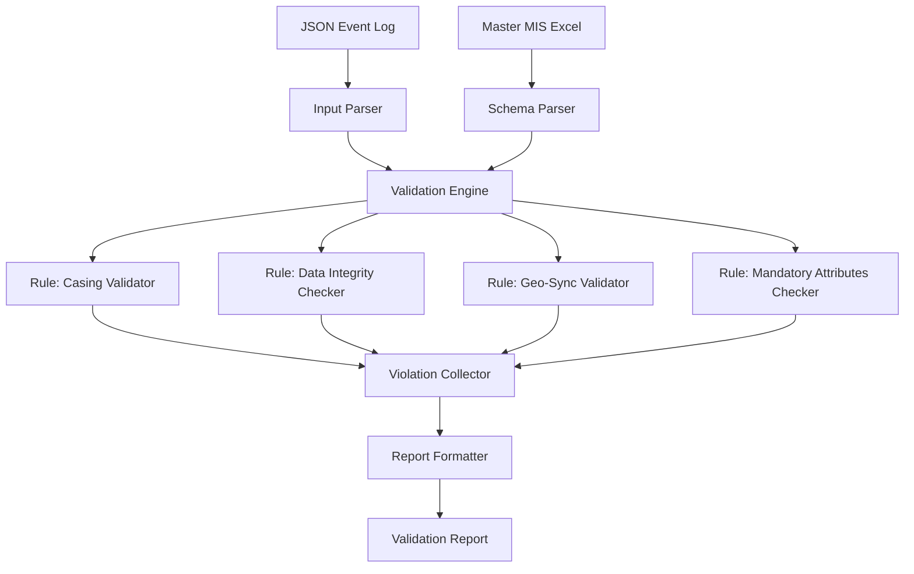

# Design Document: CleverTap Analytics QA Validator

## Overview

The CleverTap Analytics QA Validator is a TypeScript-based validation system that verifies analytics event logs against a Master MIS Excel schema. The validator is designed as an exportable function that can be integrated into the existing CleverTap tracker dashboard while also being reusable across other parts of the application.

The system performs four primary validation categories:
1. **Attribute Casing Validation** - Ensures all attribute keys follow snake_case convention
2. **Data Integrity Checks** - Detects null, empty, or invalid values
3. **Geo-Location Sync Logic** - Validates geographic consistency for international builds with VPN detection
4. **Mandatory Attribute Matrix** - Verifies presence of required attributes per event type

The validator outputs a structured validation report with professional formatting, including summary statistics, detailed violation tables, and actionable recommendations.

## Architecture

The system follows a modular pipeline architecture with clear separation of concerns:



### Key Architectural Decisions

1. **Functional Core, Imperative Shell**: The validation logic is implemented as pure functions that take parsed data and return validation results. Side effects (file I/O, Excel parsing) are isolated at the boundaries.

2. **Rule-Based Engine**: Each validation category is implemented as an independent rule that can be added, removed, or modified without affecting other rules. Rules return arrays of violations that are collected and aggregated.

3. **Schema-Driven Validation**: The Excel MIS sheet is parsed once into an in-memory schema object. This schema drives all validation logic, making the system adaptable to schema changes without code modifications.

4. **Reusable Validation Function**: The core validator is exported as a standalone function that accepts JSON and schema, returning a structured report object. This enables integration into multiple UI contexts.

## Components and Interfaces

### 1. Schema Parser

**Purpose**: Parse Master MIS Excel sheets into a structured validation schema.

**Interface**:
```typescript
interface SchemaAttribute {
  name: string;
  mandatory: boolean; // 'yes' in Excel = true
  mainAttribute: string; // Group name (e.g., 'others', 'playback')
}

interface EventSchema {
  eventName: string;
  attributes: Record<string, SchemaAttribute>;
}

interface ValidationSchema {
  events: Record<string, EventSchema>;
  sheetName: string;
}

function parseExcelSchema(
  workbook: XLSX.WorkBook,
  sheetName: string
): ValidationSchema;
```

**Implementation Notes**:
- Uses the existing `xlsx` library (already in dependencies)
- Reads header row to identify event columns (columns with underscore-separated names)
- Reads attribute rows to build attribute-to-rule mappings
- Handles the "others" group specially (attributes with mainAttribute = "others")
- Caches parsed schema to avoid repeated file reads

### 2. Input Parser

**Purpose**: Parse JSON event logs into a normalized attribute map.

**Interface**:
```typescript
interface ParsedEvent {
  attributes: Record<string, string>;
  rawJson: string;
  eventName?: string; // Extracted from JSON if present
}

function parseEventJson(jsonString: string): ParsedEvent;
```

**Implementation Notes**:
- Handles multiple JSON formats (Kibana, CleverTap, raw)
- Flattens nested objects with dot notation (e.g., `_source.message.user_id` → `user_id`)
- Special handling for `others` object: extracts sub-keys as `others(subkey)`
- Normalizes attribute names to lowercase
- Handles timestamp variants (`event_timestamp_utc`, `event_timestamp_ist` → `event_timestamp`)

### 3. Validation Engine

**Purpose**: Orchestrate validation rules and collect violations.

**Interface**:
```typescript
interface ValidationViolation {
  attribute: string;
  violationType: 'CASING' | 'DATA_INTEGRITY' | 'GEO_SYNC' | 'MISSING_MANDATORY';
  severity: 'ERROR' | 'WARNING' | 'INFO';
  expected?: string;
  actual?: string;
  message: string;
  group?: string; // 'others', 'playback', etc.
}

interface ValidationResult {
  eventName: string;
  status: 'PASS' | 'FAIL' | 'NEEDS_IMPROVEMENT';
  score: number; // 0-100
  totalAttributes: number;
  passedAttributes: number;
  violations: ValidationViolation[];
  timestamp: string;
}

function validateEvent(
  parsedEvent: ParsedEvent,
  schema: EventSchema,
  options?: ValidationOptions
): ValidationResult;
```

**Validation Options**:
```typescript
interface ValidationOptions {
  platform?: string; // 'web', 'android', 'ios', etc.
  isInternationalBuild?: boolean;
  strictCasing?: boolean; // Default: true
  allowFlexibleAttributes?: string[]; // Attributes that accept any value
}
```

### 4. Validation Rules

Each rule is a pure function that examines attributes and returns violations:

```typescript
type ValidationRule = (
  attributes: Record<string, string>,
  schema: EventSchema,
  options?: ValidationOptions
) => ValidationViolation[];
```

**Rule 1: Casing Validator**
```typescript
function validateCasing(
  attributes: Record<string, string>,
  schema: EventSchema
): ValidationViolation[];
```
- Checks all attribute keys for uppercase letters
- Validates snake_case format (lowercase with underscores)
- Does NOT validate attribute values (values can be any case)

**Rule 2: Data Integrity Checker**
```typescript
function validateDataIntegrity(
  attributes: Record<string, string>,
  schema: EventSchema
): ValidationViolation[];
```
- Flags null, undefined, empty string, whitespace-only values
- Flags uppercase "NA" as invalid
- Accepts lowercase "na" as valid
- Accepts "false" as valid for boolean attributes

**Rule 3: Geo-Sync Validator**
```typescript
function validateGeoSync(
  attributes: Record<string, string>,
  options: ValidationOptions
): ValidationViolation[];
```
- Only runs when `isInternationalBuild` is true
- Checks: if `vpn_detected === true` AND `city` has valid value
- Then: `country_code` and `currency_code` must NOT be "na"
- Reports geo-sync violations with affected attributes

**Rule 4: Mandatory Attributes Checker**
```typescript
function validateMandatoryAttributes(
  attributes: Record<string, string>,
  schema: EventSchema,
  options?: ValidationOptions
): ValidationViolation[];
```
- Verifies presence of all attributes marked as mandatory in schema
- Special handling for flexible attributes (journey IDs, experiment IDs)
- Special handling for playback events (time_to_* attributes)
- Flags missing or "na" values for mandatory attributes

### 5. Report Formatter

**Purpose**: Generate professional validation reports with tables and sections.

**Interface**:
```typescript
interface ValidationReport {
  summary: {
    status: 'PASS' | 'FAIL' | 'NEEDS_IMPROVEMENT';
    score: number;
    totalAttributes: number;
    passedAttributes: number;
    failedAttributes: number;
  };
  sections: {
    casingAndIntegrity: ValidationViolation[];
    geoLocationAudit: ValidationViolation[];
    misGapAnalysis: ValidationViolation[];
    businessLogicReview: string;
    auditorsConclusion: string;
  };
  metadata: {
    eventName: string;
    platform: string;
    timestamp: string;
  };
}

function formatValidationReport(
  result: ValidationResult,
  options?: ReportOptions
): ValidationReport;

function renderReportAsMarkdown(report: ValidationReport): string;
function renderReportAsHTML(report: ValidationReport): string;
```

**Report Structure**:
1. **Validation Status** - PASS/FAIL/NEEDS IMPROVEMENT badge
2. **Casing & Integrity Summary** - Table of casing and data violations
3. **Geo-Location Audit** - VPN and location consistency results
4. **MIS Gap Analysis** - Table of missing mandatory attributes
5. **Business Logic Review** - Overall assessment and patterns
6. **Auditor's Conclusion** - Final verdict and recommendations

### 6. Main Validator Function

**Purpose**: Public API for the validation system.

**Interface**:
```typescript
export interface ValidatorInput {
  eventJson: string;
  eventName?: string; // Optional, can be extracted from JSON
  schema?: ValidationSchema; // Optional, uses default if not provided
  options?: ValidationOptions;
}

export interface ValidatorOutput {
  success: boolean;
  result?: ValidationResult;
  report?: ValidationReport;
  error?: string;
}

export async function validateCleverTapEvent(
  input: ValidatorInput
): Promise<ValidatorOutput>;
```

**Usage Example**:
```typescript
import { validateCleverTapEvent } from '@/lib/clevertap-validator';

const result = await validateCleverTapEvent({
  eventJson: '{"event_name": "content_played", "user_id": "123", ...}',
  eventName: 'content_played',
  options: {
    platform: 'android',
    isInternationalBuild: true
  }
});

if (result.success) {
  console.log(`Score: ${result.result.score}%`);
  console.log(result.report);
}
```

## Data Models

### Core Data Structures

```typescript
// Validation violation with full context
interface ValidationViolation {
  attribute: string;
  violationType: 'CASING' | 'DATA_INTEGRITY' | 'GEO_SYNC' | 'MISSING_MANDATORY';
  severity: 'ERROR' | 'WARNING' | 'INFO';
  expected?: string;
  actual?: string;
  message: string;
  group?: string;
}

// Complete validation result
interface ValidationResult {
  eventName: string;
  status: 'PASS' | 'FAIL' | 'NEEDS_IMPROVEMENT';
  score: number;
  totalAttributes: number;
  passedAttributes: number;
  violations: ValidationViolation[];
  timestamp: string;
}

// Schema representation
interface SchemaAttribute {
  name: string;
  mandatory: boolean;
  mainAttribute: string;
}

interface EventSchema {
  eventName: string;
  attributes: Record<string, SchemaAttribute>;
}

interface ValidationSchema {
  events: Record<string, EventSchema>;
  sheetName: string;
}

// Report output
interface ValidationReport {
  summary: {
    status: 'PASS' | 'FAIL' | 'NEEDS_IMPROVEMENT';
    score: number;
    totalAttributes: number;
    passedAttributes: number;
    failedAttributes: number;
  };
  sections: {
    casingAndIntegrity: ValidationViolation[];
    geoLocationAudit: ValidationViolation[];
    misGapAnalysis: ValidationViolation[];
    businessLogicReview: string;
    auditorsConclusion: string;
  };
  metadata: {
    eventName: string;
    platform: string;
    timestamp: string;
  };
}
```

### Status Determination Logic

```typescript
function determineStatus(score: number, violations: ValidationViolation[]): 'PASS' | 'FAIL' | 'NEEDS_IMPROVEMENT' {
  if (score === 100) return 'PASS';
  
  const hasErrors = violations.some(v => v.severity === 'ERROR');
  if (hasErrors) return 'FAIL';
  
  if (score >= 70) return 'NEEDS_IMPROVEMENT';
  return 'FAIL';
}
```

### Score Calculation

```typescript
function calculateScore(
  totalAttributes: number,
  passedAttributes: number
): number {
  if (totalAttributes === 0) return 0;
  return Math.round((passedAttributes / totalAttributes) * 100);
}
```

## Integration with Existing System

### Current Implementation Analysis

The existing CleverTap tracker page (`src/app/(app)/dashboard/clevertap-tracker/page.tsx`) already implements:
- Excel schema parsing using `xlsx` library
- JSON parsing with multiple format support
- Validation logic with status codes (`PASS`, `MISSING`, `VALUE_REQUIRED`, etc.)
- Export functionality to Excel sheets
- UI components for displaying validation results

### Refactoring Strategy

The new validator will extract and modularize the existing validation logic:

1. **Extract Schema Parser**: Move Excel parsing logic from the page component into `src/lib/clevertap-validator/schema-parser.ts`

2. **Extract Validation Rules**: Move validation logic from `validateParams` function into individual rule modules in `src/lib/clevertap-validator/rules/`

3. **Create Main Validator**: Implement the public API function in `src/lib/clevertap-validator/index.ts`

4. **Update Page Component**: Refactor the page to use the new validator function instead of inline validation

### File Structure

```
src/lib/clevertap-validator/
├── index.ts                 # Main validator function (public API)
├── schema-parser.ts         # Excel schema parsing
├── input-parser.ts          # JSON event parsing
├── validation-engine.ts     # Rule orchestration
├── report-formatter.ts      # Report generation
├── rules/
│   ├── casing-validator.ts
│   ├── data-integrity-checker.ts
│   ├── geo-sync-validator.ts
│   └── mandatory-attributes-checker.ts
└── types.ts                 # Shared TypeScript types
```

### Integration Points

1. **CleverTap Tracker Page**: Import and use `validateCleverTapEvent` function
2. **Export Functions**: Extend `src/lib/export-to-sheets.ts` to include new report format
3. **Schema Loading**: Reuse existing Excel file loading from `/public/SunNxt Data Dictionary.xlsx`

## Error Handling

### Error Categories

1. **Input Errors**
   - Invalid JSON format
   - Missing required fields in input
   - Malformed event structure

2. **Schema Errors**
   - Excel file not found
   - Invalid Excel format
   - Missing required columns
   - Sheet not found

3. **Validation Errors**
   - Event not found in schema
   - Unexpected data types
   - Rule execution failures

### Error Handling Strategy

```typescript
// All errors are caught and returned as structured responses
interface ValidatorError {
  code: string;
  message: string;
  details?: any;
}

// Example error responses
{
  success: false,
  error: {
    code: 'INVALID_JSON',
    message: 'Failed to parse event JSON',
    details: { line: 5, column: 12 }
  }
}

{
  success: false,
  error: {
    code: 'SCHEMA_NOT_FOUND',
    message: 'Event "custom_event" not found in schema',
    details: { availableEvents: ['app_launch', 'content_click', ...] }
  }
}
```

### Graceful Degradation

- If schema is not provided, validator performs basic JSON validation only
- If event not found in schema, validator reports all attributes as "EXTRA"
- If Excel file fails to load, validator uses fallback schema for core events
- Missing optional attributes do not cause validation failure

## Testing Strategy

The validation system will be tested using a dual approach combining unit tests and property-based tests.

### Unit Testing

Unit tests will focus on:
- **Specific examples**: Known good and bad event payloads
- **Edge cases**: Empty JSON, malformed Excel, missing attributes
- **Integration points**: Schema parser with real Excel files, report formatter output
- **Error conditions**: Invalid inputs, missing files, malformed data

Example unit tests:
- Parse valid Excel schema and verify event count
- Parse JSON with uppercase attribute and detect casing violation
- Validate event with missing mandatory attribute
- Generate report and verify section structure

### Property-Based Testing

Property-based tests will verify universal properties across all inputs using `fast-check` library (JavaScript/TypeScript PBT library).

**Configuration**:
- Minimum 100 iterations per property test
- Each test tagged with: `Feature: clevertap-analytics-validator, Property {N}: {property_text}`
- Tests run on every build to catch regressions

**Test Data Generators**:
```typescript
// Generate random valid event JSON
const validEventArbitrary = fc.record({
  event_name: fc.constantFrom('app_launch', 'content_click', 'content_played'),
  user_id: fc.string({ minLength: 1 }),
  platform: fc.constantFrom('android', 'ios', 'web'),
  // ... other attributes
});

// Generate random attribute names (snake_case)
const snakeCaseAttrArbitrary = fc.string()
  .filter(s => s.length > 0 && /^[a-z][a-z0-9_]*$/.test(s));

// Generate random invalid values (null, empty, NA)
const invalidValueArbitrary = fc.constantFrom(null, '', '  ', 'NA', 'N/A', 'null', 'undefined');
```


## Correctness Properties

*A property is a characteristic or behavior that should hold true across all valid executions of a system—essentially, a formal statement about what the system should do. Properties serve as the bridge between human-readable specifications and machine-verifiable correctness guarantees.*

### Property 1: Attribute Keys Must Be Lowercase Snake Case

*For any* event JSON with attribute keys, all keys containing uppercase letters should be flagged as casing violations, and all keys should be validated for snake_case format (lowercase with underscores only).

**Validates: Requirements 1.1, 1.2, 1.4**

### Property 2: Attribute Values Accept Any Casing

*For any* attribute value (not key), regardless of casing (uppercase, lowercase, mixed case), the validator should not flag it as a casing violation.

**Validates: Requirements 1.3**

### Property 3: Invalid Values Are Detected

*For any* attribute with a value that is null, undefined, empty string, whitespace-only, or uppercase "NA", the validator should flag it as a data integrity violation.

**Validates: Requirements 2.1, 2.2, 2.3, 2.4**

### Property 4: Geo-Sync Validation For International Builds

*For any* event where `vpn_detected` is true AND `city` has a valid (non-na) value, both `country_code` and `currency_code` must not be "na", otherwise a geo-sync violation should be flagged.

**Validates: Requirements 3.2, 3.3, 3.4, 3.5**

### Property 5: Mandatory Attributes Are Enforced

*For any* event and its corresponding schema, all attributes marked as mandatory in the schema must be present in the event and must not have "na" values, otherwise a mandatory attribute violation should be flagged.

**Validates: Requirements 4.1, 4.2, 4.3, 4.4, 4.5, 4.6, 4.7, 4.8, 4.9**

### Property 6: Violations Include Complete Context

*For any* validation violation (casing, data integrity, geo-sync, or mandatory), the violation object should include the attribute name and the actual value found.

**Validates: Requirements 1.5, 2.6, 3.6**

### Property 7: Validation Status Is Always Determined

*For any* event validation result, the status must be exactly one of: PASS, FAIL, or NEEDS_IMPROVEMENT.

**Validates: Requirements 5.1**

### Property 8: Report Contains Required Statistics

*For any* validation result, the formatted report should include summary statistics: total attributes count, passed attributes count, failed attributes count, and score percentage.

**Validates: Requirements 10.4**

### Property 9: Report Contains Timestamp

*For any* validation result, the formatted report should include a timestamp indicating when the validation was performed.

**Validates: Requirements 10.7**

### Property 10: Invalid JSON Returns Error Response

*For any* invalid JSON input, the validator should return a structured error response (not throw an exception) with an error code and message.

**Validates: Requirements 6.7**

### Property 11: Schema Parser Extracts Events

*For any* valid Excel sheet with event columns in the header row, the schema parser should extract all event names and build a schema mapping events to their attributes.

**Validates: Requirements 8.2, 8.3, 8.4**

### Property 12: Schema Parser Handles Malformed Input

*For any* malformed or invalid Excel input, the schema parser should return an error or empty schema without throwing an exception.

**Validates: Requirements 8.5**

### Property 13: Batch Validation Produces Multiple Results

*For any* array of N event JSONs, batch validation should produce exactly N validation results, one for each input event.

**Validates: Requirements 7.4**

### Property 14: Validator Returns Structured Output

*For any* input (valid or invalid), the validator should return an object with a `success` boolean field and either a `result` field (on success) or an `error` field (on failure).

**Validates: Requirements 6.4**

### Property 15: Geo-Sync Only Runs For International Builds

*For any* event where the platform or app_id indicates a domestic build, geo-sync validation rules should not be applied, and no geo-sync violations should be reported.

**Validates: Requirements 3.1**

### Property 16: All Rules Execute In Single Pass

*For any* event, running validation should detect all violation types (casing, data integrity, geo-sync, mandatory) in a single execution, without requiring multiple validation calls.

**Validates: Requirements 9.5**

### Property 17: Violations Have Severity Levels

*For any* validation violation, it should have a severity level assigned (ERROR, WARNING, or INFO).

**Validates: Requirements 9.6**

## Testing Strategy

The CleverTap Analytics QA Validator will be tested using a comprehensive dual approach combining unit tests and property-based tests.

### Unit Testing

Unit tests will verify specific examples, edge cases, and integration points:

**Schema Parser Tests**:
- Parse a valid Excel file and verify event count matches expected
- Parse Excel with missing columns and verify graceful error handling
- Parse Excel with "others" group attributes and verify correct grouping
- Verify caching behavior (second parse doesn't re-read file)

**Input Parser Tests**:
- Parse Kibana JSON format and verify attribute extraction
- Parse CleverTap JSON format and verify attribute extraction
- Parse JSON with nested `others` object and verify `others(key)` format
- Parse JSON with timestamp variants and verify normalization
- Parse invalid JSON and verify error response

**Validation Rules Tests**:
- Validate event with uppercase attribute key and verify CAPITAL_ATTR violation
- Validate event with null value and verify VALUE_REQUIRED violation
- Validate international build with VPN and invalid country_code and verify GEO_SYNC violation
- Validate event missing mandatory attribute and verify MISSING violation
- Validate event with lowercase "na" value and verify it's accepted

**Report Formatter Tests**:
- Format validation result and verify all required sections are present
- Format result with violations and verify violation table structure
- Format result with 100% score and verify PASS status
- Generate HTML report and verify HTML structure
- Generate markdown report and verify markdown structure

**Integration Tests**:
- Validate real event JSON from production logs
- Parse real Master MIS Excel file and validate against it
- Export validation results to Excel and verify sheet structure

### Property-Based Testing

Property-based tests will verify universal properties across randomized inputs using the `fast-check` library.

**Test Configuration**:
- Library: `fast-check` (install via `npm install --save-dev fast-check @types/fast-check`)
- Minimum iterations: 100 per property test
- Each test tagged with: `Feature: clevertap-analytics-validator, Property {N}: {property_text}`

**Property Test Suite**:

**Property 1: Attribute Keys Must Be Lowercase Snake Case**
```typescript
// Feature: clevertap-analytics-validator, Property 1: Attribute keys must be lowercase snake_case
fc.assert(
  fc.property(
    fc.record({
      event_name: fc.constant('test_event'),
      ...fc.dictionary(
        fc.string().filter(s => /[A-Z]/.test(s)), // Keys with uppercase
        fc.string()
      )
    }),
    (eventJson) => {
      const result = validateCleverTapEvent({ eventJson: JSON.stringify(eventJson) });
      const casingViolations = result.result?.violations.filter(v => v.violationType === 'CASING');
      return casingViolations && casingViolations.length > 0;
    }
  ),
  { numRuns: 100 }
);
```

**Property 2: Attribute Values Accept Any Casing**
```typescript
// Feature: clevertap-analytics-validator, Property 2: Attribute values accept any casing
fc.assert(
  fc.property(
    fc.record({
      event_name: fc.constant('test_event'),
      test_attr: fc.string({ minLength: 1 }) // Any casing in value
    }),
    (eventJson) => {
      const result = validateCleverTapEvent({ eventJson: JSON.stringify(eventJson) });
      const valueCasingViolations = result.result?.violations.filter(
        v => v.violationType === 'CASING' && v.attribute === 'test_attr'
      );
      return valueCasingViolations?.length === 0;
    }
  ),
  { numRuns: 100 }
);
```

**Property 3: Invalid Values Are Detected**
```typescript
// Feature: clevertap-analytics-validator, Property 3: Invalid values are detected
fc.assert(
  fc.property(
    fc.constantFrom(null, '', '  ', 'NA', 'N/A', 'null', 'undefined'),
    (invalidValue) => {
      const eventJson = JSON.stringify({ event_name: 'test_event', test_attr: invalidValue });
      const schema = { test_event: { test_attr: { mandatory: true, mainAttribute: '' } } };
      const result = validateCleverTapEvent({ eventJson, schema });
      const integrityViolations = result.result?.violations.filter(
        v => v.violationType === 'DATA_INTEGRITY' && v.attribute === 'test_attr'
      );
      return integrityViolations && integrityViolations.length > 0;
    }
  ),
  { numRuns: 100 }
);
```

**Property 4: Geo-Sync Validation For International Builds**
```typescript
// Feature: clevertap-analytics-validator, Property 4: Geo-sync validation for international builds
fc.assert(
  fc.property(
    fc.record({
      vpn_detected: fc.constant('true'),
      city: fc.string({ minLength: 1 }).filter(s => s.toLowerCase() !== 'na'),
      country_code: fc.constant('na'),
      currency_code: fc.constant('na')
    }),
    (eventAttrs) => {
      const eventJson = JSON.stringify({ event_name: 'test_event', ...eventAttrs });
      const result = validateCleverTapEvent({ 
        eventJson, 
        options: { isInternationalBuild: true } 
      });
      const geoViolations = result.result?.violations.filter(v => v.violationType === 'GEO_SYNC');
      return geoViolations && geoViolations.length >= 2; // Both country_code and currency_code
    }
  ),
  { numRuns: 100 }
);
```

**Property 5: Mandatory Attributes Are Enforced**
```typescript
// Feature: clevertap-analytics-validator, Property 5: Mandatory attributes are enforced
fc.assert(
  fc.property(
    fc.array(fc.string().filter(s => s.length > 0 && /^[a-z][a-z0-9_]*$/.test(s)), { minLength: 1, maxLength: 10 }),
    (mandatoryAttrs) => {
      const schema = {
        test_event: Object.fromEntries(
          mandatoryAttrs.map(attr => [attr, { mandatory: true, mainAttribute: '' }])
        )
      };
      const eventJson = JSON.stringify({ event_name: 'test_event' }); // Missing all mandatory attrs
      const result = validateCleverTapEvent({ eventJson, schema });
      const missingViolations = result.result?.violations.filter(
        v => v.violationType === 'MISSING_MANDATORY'
      );
      return missingViolations && missingViolations.length === mandatoryAttrs.length;
    }
  ),
  { numRuns: 100 }
);
```

**Property 6: Violations Include Complete Context**
```typescript
// Feature: clevertap-analytics-validator, Property 6: Violations include complete context
fc.assert(
  fc.property(
    fc.record({
      event_name: fc.constant('test_event'),
      TestAttr: fc.string() // Uppercase key to trigger violation
    }),
    (eventJson) => {
      const result = validateCleverTapEvent({ eventJson: JSON.stringify(eventJson) });
      const violations = result.result?.violations || [];
      return violations.every(v => 
        v.attribute !== undefined && 
        v.attribute.length > 0 &&
        (v.actual !== undefined || v.expected !== undefined)
      );
    }
  ),
  { numRuns: 100 }
);
```

**Property 7: Validation Status Is Always Determined**
```typescript
// Feature: clevertap-analytics-validator, Property 7: Validation status is always determined
fc.assert(
  fc.property(
    fc.record({
      event_name: fc.string({ minLength: 1 }),
      user_id: fc.string()
    }),
    (eventJson) => {
      const result = validateCleverTapEvent({ eventJson: JSON.stringify(eventJson) });
      if (!result.success) return true; // Error responses don't have status
      const validStatuses = ['PASS', 'FAIL', 'NEEDS_IMPROVEMENT'];
      return validStatuses.includes(result.result?.status || '');
    }
  ),
  { numRuns: 100 }
);
```

**Property 8: Report Contains Required Statistics**
```typescript
// Feature: clevertap-analytics-validator, Property 8: Report contains required statistics
fc.assert(
  fc.property(
    fc.record({
      event_name: fc.constant('test_event'),
      attr1: fc.string(),
      attr2: fc.string()
    }),
    (eventJson) => {
      const result = validateCleverTapEvent({ eventJson: JSON.stringify(eventJson) });
      if (!result.success || !result.report) return true;
      const summary = result.report.summary;
      return (
        typeof summary.score === 'number' &&
        typeof summary.totalAttributes === 'number' &&
        typeof summary.passedAttributes === 'number' &&
        typeof summary.failedAttributes === 'number'
      );
    }
  ),
  { numRuns: 100 }
);
```

**Property 9: Report Contains Timestamp**
```typescript
// Feature: clevertap-analytics-validator, Property 9: Report contains timestamp
fc.assert(
  fc.property(
    fc.record({
      event_name: fc.constant('test_event'),
      user_id: fc.string()
    }),
    (eventJson) => {
      const result = validateCleverTapEvent({ eventJson: JSON.stringify(eventJson) });
      if (!result.success || !result.report) return true;
      return (
        result.report.metadata.timestamp !== undefined &&
        result.report.metadata.timestamp.length > 0
      );
    }
  ),
  { numRuns: 100 }
);
```

**Property 10: Invalid JSON Returns Error Response**
```typescript
// Feature: clevertap-analytics-validator, Property 10: Invalid JSON returns error response
fc.assert(
  fc.property(
    fc.string().filter(s => {
      try { JSON.parse(s); return false; } catch { return true; }
    }),
    (invalidJson) => {
      const result = validateCleverTapEvent({ eventJson: invalidJson });
      return (
        result.success === false &&
        result.error !== undefined &&
        result.error.length > 0
      );
    }
  ),
  { numRuns: 100 }
);
```

**Property 11: Schema Parser Extracts Events**
```typescript
// Feature: clevertap-analytics-validator, Property 11: Schema parser extracts events
fc.assert(
  fc.property(
    fc.array(fc.string().filter(s => s.length > 0 && s.includes('_')), { minLength: 1, maxLength: 20 }),
    (eventNames) => {
      // Create mock Excel with event names in header
      const mockWorkbook = createMockExcelWithEvents(eventNames);
      const schema = parseExcelSchema(mockWorkbook, 'Test Sheet');
      const extractedEvents = Object.keys(schema.events);
      return eventNames.every(ev => extractedEvents.includes(ev));
    }
  ),
  { numRuns: 100 }
);
```

**Property 12: Schema Parser Handles Malformed Input**
```typescript
// Feature: clevertap-analytics-validator, Property 12: Schema parser handles malformed input
fc.assert(
  fc.property(
    fc.record({
      SheetNames: fc.array(fc.string()),
      Sheets: fc.dictionary(fc.string(), fc.constant(null)) // Malformed sheets
    }),
    (malformedWorkbook) => {
      try {
        const schema = parseExcelSchema(malformedWorkbook as any, 'NonExistent');
        return schema !== undefined; // Should return something, not throw
      } catch {
        return false; // Should not throw
      }
    }
  ),
  { numRuns: 100 }
);
```

**Property 13: Batch Validation Produces Multiple Results**
```typescript
// Feature: clevertap-analytics-validator, Property 13: Batch validation produces multiple results
fc.assert(
  fc.property(
    fc.array(
      fc.record({
        event_name: fc.constantFrom('app_launch', 'content_click', 'content_played'),
        user_id: fc.string()
      }),
      { minLength: 1, maxLength: 10 }
    ),
    async (events) => {
      const results = await Promise.all(
        events.map(e => validateCleverTapEvent({ eventJson: JSON.stringify(e) }))
      );
      return results.length === events.length;
    }
  ),
  { numRuns: 100 }
);
```

**Property 14: Validator Returns Structured Output**
```typescript
// Feature: clevertap-analytics-validator, Property 14: Validator returns structured output
fc.assert(
  fc.property(
    fc.oneof(
      fc.record({ event_name: fc.string(), user_id: fc.string() }), // Valid
      fc.string() // Invalid JSON
    ),
    async (input) => {
      const jsonStr = typeof input === 'string' ? input : JSON.stringify(input);
      const result = await validateCleverTapEvent({ eventJson: jsonStr });
      return (
        typeof result.success === 'boolean' &&
        (result.success ? result.result !== undefined : result.error !== undefined)
      );
    }
  ),
  { numRuns: 100 }
);
```

**Property 15: Geo-Sync Only Runs For International Builds**
```typescript
// Feature: clevertap-analytics-validator, Property 15: Geo-sync only runs for international builds
fc.assert(
  fc.property(
    fc.record({
      event_name: fc.constant('test_event'),
      vpn_detected: fc.constant('true'),
      city: fc.string({ minLength: 1 }),
      country_code: fc.constant('na')
    }),
    async (eventAttrs) => {
      const domesticResult = await validateCleverTapEvent({
        eventJson: JSON.stringify(eventAttrs),
        options: { isInternationalBuild: false }
      });
      const internationalResult = await validateCleverTapEvent({
        eventJson: JSON.stringify(eventAttrs),
        options: { isInternationalBuild: true }
      });
      
      const domesticGeoViolations = domesticResult.result?.violations.filter(v => v.violationType === 'GEO_SYNC') || [];
      const intlGeoViolations = internationalResult.result?.violations.filter(v => v.violationType === 'GEO_SYNC') || [];
      
      return domesticGeoViolations.length === 0 && intlGeoViolations.length > 0;
    }
  ),
  { numRuns: 100 }
);
```

**Property 16: All Rules Execute In Single Pass**
```typescript
// Feature: clevertap-analytics-validator, Property 16: All rules execute in single pass
fc.assert(
  fc.property(
    fc.record({
      event_name: fc.constant('test_event'),
      TestAttr: fc.constant('value'), // Casing violation
      mandatory_attr: fc.constant('NA'), // Data integrity violation
      vpn_detected: fc.constant('true'),
      city: fc.constant('Mumbai'),
      country_code: fc.constant('na') // Geo-sync violation
    }),
    async (eventAttrs) => {
      const schema = {
        test_event: {
          testattr: { mandatory: true, mainAttribute: '' },
          mandatory_attr: { mandatory: true, mainAttribute: '' },
          country_code: { mandatory: true, mainAttribute: '' }
        }
      };
      const result = await validateCleverTapEvent({
        eventJson: JSON.stringify(eventAttrs),
        schema,
        options: { isInternationalBuild: true }
      });
      
      const violationTypes = new Set(result.result?.violations.map(v => v.violationType) || []);
      // Should detect multiple violation types in one pass
      return violationTypes.size >= 2;
    }
  ),
  { numRuns: 100 }
);
```

**Property 17: Violations Have Severity Levels**
```typescript
// Feature: clevertap-analytics-validator, Property 17: Violations have severity levels
fc.assert(
  fc.property(
    fc.record({
      event_name: fc.constant('test_event'),
      TestAttr: fc.string() // Will trigger casing violation
    }),
    async (eventJson) => {
      const result = await validateCleverTapEvent({ eventJson: JSON.stringify(eventJson) });
      const violations = result.result?.violations || [];
      const validSeverities = ['ERROR', 'WARNING', 'INFO'];
      return violations.every(v => validSeverities.includes(v.severity));
    }
  ),
  { numRuns: 100 }
);
```

### Test Organization

```
src/lib/clevertap-validator/__tests__/
├── unit/
│   ├── schema-parser.test.ts
│   ├── input-parser.test.ts
│   ├── casing-validator.test.ts
│   ├── data-integrity-checker.test.ts
│   ├── geo-sync-validator.test.ts
│   ├── mandatory-attributes-checker.test.ts
│   └── report-formatter.test.ts
├── property/
│   ├── casing-properties.test.ts
│   ├── data-integrity-properties.test.ts
│   ├── geo-sync-properties.test.ts
│   ├── mandatory-attributes-properties.test.ts
│   └── validator-properties.test.ts
└── integration/
    ├── real-events.test.ts
    └── excel-integration.test.ts
```

### Testing Balance

- Unit tests focus on specific examples and edge cases (e.g., "validate event with null value")
- Property tests focus on universal rules (e.g., "for any event with null values, violations are detected")
- Integration tests verify end-to-end workflows with real data
- Property tests provide comprehensive input coverage through randomization (100+ iterations)
- Unit tests catch concrete bugs in specific scenarios
- Together, they provide comprehensive coverage of both specific cases and general correctness

