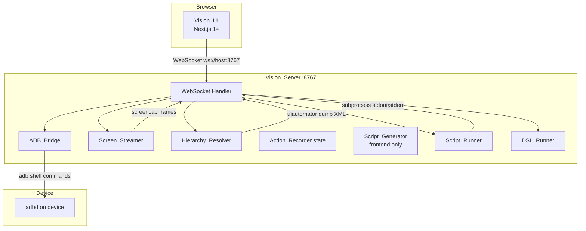

# Design Document: Zenit Vision Appium Recorder

## Overview

Zenit Vision is a full-screen device inspection and test automation recording tool embedded in the Zenit QA platform. This design covers the transformation from the current mock-data prototype into a production-ready system that streams a real Android device screen via ADB, captures element locators on every interaction, records actions into a structured IAM, generates complete runnable Appium scripts in Python/Java/JavaScript, and executes those scripts via a backend subprocess runner.

The system is split into two runtime processes:
- **Vision_UI** — Next.js 14 frontend at `/dashboard/vision`, communicating exclusively over WebSocket to port 8767
- **Vision_Server** — Python FastAPI backend on port 8767 (WebSocket) and 8000 (REST), owning all ADB interaction

---

## Architecture



The frontend Script_Generator runs entirely in the browser — it converts the in-memory IAM action list into script text with no server round-trip. The Script_Runner on the backend receives the finished script text over WebSocket and executes it.

---

## Components and Interfaces

### ADB_Bridge

Wraps all `adb` subprocess calls. Exposes async methods:

```python
class ADB_Bridge:
    async def list_devices() -> list[dict]          # adb devices -l
    async def get_model(udid: str) -> str           # adb -s {udid} shell getprop ro.product.model
    async def get_foreground_package(udid: str) -> str  # adb shell dumpsys window windows
    async def screencap(udid: str) -> bytes         # adb exec-out screencap -p
    async def dump_hierarchy(udid: str) -> str      # uiautomator dump + adb pull → XML string
    async def tap(udid: str, x: int, y: int)
    async def swipe(udid: str, x1,y1,x2,y2: int, duration_ms: int)
    async def type_text(udid: str, text: str)
    async def keyevent(udid: str, keycode: int)     # 3=HOME, 4=BACK
    async def long_press(udid: str, x: int, y: int, duration_ms: int)
```

All methods raise `ADBError` on non-zero exit codes. Timeouts are enforced via `asyncio.wait_for`.

### Screen_Streamer

Runs as a background `asyncio.Task` per WebSocket session. Continuously captures frames and pushes them to the client.

```python
class Screen_Streamer:
    target_fps: int = 5          # ~200ms between frames
    retry_delay_ms: int = 500    # on screencap failure
    after_action_delay_ms: int = 800

    async def run(session_id, adb, ws_send)
    async def capture_after_action(session_id, adb, ws_send)
```

Frame message format (JSON):
```json
{ "type": "frame", "screenshot": "<base64 PNG>", "afterAction": false }
```

Binary alternative: 4-byte big-endian length header + raw PNG bytes.

### Hierarchy_Resolver

Fetches and parses the UI hierarchy on demand and after actions.

```python
class Hierarchy_Resolver:
    stale_timeout_s: int = 5

    async def fetch(udid: str) -> dict          # returns normalized tree
    def parse_xml(xml: str, screen_w: int, screen_h: int) -> dict
    def normalize_node(node: ET.Element, w: int, h: int) -> dict
    def find_at(tree: dict, ratio_x: float, ratio_y: float) -> dict | None
    def build_locators(node: dict) -> dict
    def generate_xpath(node: dict) -> str
```

Normalized node schema:
```json
{
  "id": "unique_string",
  "type": "TextView",
  "name": "content-desc or text",
  "attributes": {
    "resourceId": "com.pkg:id/name",
    "contentDesc": "...",
    "text": "...",
    "bounds": { "x": 0.1, "y": 0.2, "width": 0.3, "height": 0.05 },
    "clickable": true,
    "enabled": true,
    "scrollable": false
  },
  "children": []
}
```

Bounds conversion: given raw `[x1,y1][x2,y2]` and screen `(W, H)`:
```
x = x1 / W,  y = y1 / H,  width = (x2-x1) / W,  height = (y2-y1) / H
```

### WebSocket Message Protocol

All messages are JSON unless the frame is sent as binary.

**Client → Server:**

| `type` | Payload fields | Description |
|---|---|---|
| `action` | `payload: { action, ratioX, ratioY, ... }` | Device interaction |
| `refresh_hierarchy` | — | Force hierarchy re-fetch |
| `run_appium_script` | `script, language` | Execute Appium script |
| `run_manual_script` | `lines[]` | Execute DSL commands |
| `stop_script` | — | Kill running subprocess |
| `save_local_recording` | `name, actions[]` | Persist recording to disk |

**Server → Client:**

| `type` | Key fields | Description |
|---|---|---|
| `device_status` | `connected, id, model, reason?` | Device connect/disconnect |
| `frame` | `screenshot (base64), afterAction` | Screen frame |
| `state` | `hierarchy, currentPackage, deviceModel, stale?` | Full device state |
| `action_done` | `locators` | Action executed, locators resolved |
| `log` | `message, level (info/error/success/warn)` | Script runner output |
| `recording_saved` | `path` | Recording file written |

### Script_Generator (Frontend)

Pure TypeScript function — no server call. Runs in the browser.

```typescript
function generateScript(
  actions: VisionAction[],
  lang: 'python' | 'java' | 'javascript',
  udid: string,
  appPackage: string,
  deviceModel: string
): string
```

Locator priority selection (applied per action):
1. `resourceId` — if non-empty and not a bare `android:id/` system ID
2. `accessibilityId` (contentDesc)
3. `text` — if non-empty and ≤ 50 characters
4. `xpath` — generated fallback

### Script_Runner (Backend)

```python
class Script_Runner:
    timeout_s: int = 300

    async def run(script: str, language: str, session_id: str, ws_send)
    async def stop(session_id: str)
```

Execution flow:
1. Write script to `tempfile.NamedTemporaryFile` with correct extension (`.py` / `.js`)
2. Spawn subprocess: `python3 <file>` or `node <file>`
3. Stream stdout lines as `{ type: "log", level: "info", message: line }`
4. Stream stderr lines as `{ type: "log", level: "error", message: line }`
5. On exit 0: send `{ level: "success", message: "Script completed successfully" }`
6. On non-zero: send `{ level: "error", message: "Script failed with exit code {N}" }`
7. On timeout: `SIGTERM` subprocess, send timeout error log

### DSL_Runner (Backend — retained)

Processes `run_manual_script` messages. Parses each line and dispatches to `ADB_Bridge`. Supported commands: `tap x y`, `type text`, `swipe x1 y1 x2 y2`, `home`, `back`, `wait seconds`, `screenshot`.

---

## Data Models

### VisionAction (IAM) — `src/types/vision.ts`

Extended `ActionType` to cover all recorded interactions:

```typescript
export type ActionType =
  | 'CLICK'
  | 'TYPE'
  | 'SWIPE'
  | 'SWIPE_UP'
  | 'SWIPE_DOWN'
  | 'SWIPE_LEFT'
  | 'SWIPE_RIGHT'
  | 'LONG_PRESS'
  | 'DOUBLE_TAP'
  | 'ASSERT_VISIBLE'
  | 'ASSERT_TEXT'
  | 'WAIT_FOR'
  | 'SCROLL_UP'
  | 'SCROLL_DOWN'
  | 'HOME'
  | 'BACK'
  | 'WAIT'
  | 'PLAY_CONTENT'
  | 'PAUSE_PLAYBACK'
  | 'SEEK_TO';
```

`VisionAction.metadata` carries swipe coordinates:
```typescript
metadata?: {
  ratioX1?: number; ratioY1?: number;
  ratioX2?: number; ratioY2?: number;
  [key: string]: any;
}
```

### ElementLocator — `src/types/vision.ts`

```typescript
export interface ElementLocator {
  accessibilityId?: string;
  resourceId?: string;
  xpath?: string;
  className?: string;
  text?: string;
  index?: number;
}
```

### Backend Session State

```python
@dataclass
class DeviceSession:
    udid: str
    model: str
    screen_w: int
    screen_h: int
    current_package: str
    hierarchy: dict | None
    hierarchy_stale: bool
    streamer_task: asyncio.Task | None
    runner_process: asyncio.subprocess.Process | None
```

### Recording File Format (`recordings/<name>.json`)

```json
{
  "name": "string",
  "device": "string",
  "udid": "string",
  "package": "string",
  "platform": "ANDROID",
  "timestamp": "ISO8601",
  "actions": [ /* VisionAction[] */ ]
}
```

---

## Correctness Properties

*A property is a characteristic or behavior that should hold true across all valid executions of a system — essentially, a formal statement about what the system should do. Properties serve as the bridge between human-readable specifications and machine-verifiable correctness guarantees.*

### Property 1: Device status message shape

*For any* ADB device enumeration result (connected or not), the `device_status` WebSocket message must contain a boolean `connected` field; when `true` it must also contain non-empty `id` and `model` fields; when `false` it must contain a non-empty `reason` string.

**Validates: Requirements 1.3, 1.4**

---

### Property 2: Foreground package included in state

*For any* connected device session, every `state` WebSocket message must include a `currentPackage` field whose value matches the output of `adb shell dumpsys window windows` parsed for the focused window.

**Validates: Requirements 1.6**

---

### Property 3: Frame encoding round-trip

*For any* PNG byte sequence captured from the device, encoding it as base64 and embedding it in a `frame` message, then decoding the base64 field on the client, must produce a byte sequence identical to the original.

**Validates: Requirements 2.1**

---

### Property 4: Streamer resilience on screencap failure

*For any* sequence of screencap calls where some fail with a non-zero exit code, the Screen_Streamer task must remain alive (not raise an unhandled exception) and must attempt the next capture after the retry delay.

**Validates: Requirements 2.6**

---

### Property 5: Hierarchy normalization correctness

*For any* valid `uiautomator dump` XML and screen resolution `(W, H)`, every node in the parsed tree must contain the fields `id`, `type`, `name`, `attributes` (with sub-fields `resourceId`, `contentDesc`, `text`, `bounds`, `clickable`, `enabled`, `scrollable`), and `children`; and every `bounds` value must satisfy `0 ≤ x, y, width, height` and `x + width ≤ 1.0`, `y + height ≤ 1.0`.

**Validates: Requirements 3.4, 3.5**

---

### Property 6: Stale flag on hierarchy timeout

*For any* session where `uiautomator dump` times out or fails, the `state` message sent to the client must include `stale: true` and must contain the last successfully parsed hierarchy (not null).

**Validates: Requirements 3.6**

---

### Property 7: Deepest element hit-test

*For any* normalized hierarchy tree and any ratio coordinate `(rx, ry)` that falls within the bounds of at least one element, `find_at(tree, rx, ry)` must return a node whose bounds contain `(rx, ry)` and which has no child whose bounds also contain `(rx, ry)` (i.e., the deepest match).

**Validates: Requirements 4.1**

---

### Property 8: Locator completeness

*For any* normalized element node, `build_locators(node)` must return a dict containing exactly the keys `resourceId`, `accessibilityId`, `text`, `className`, and `xpath`; each key's value must be the corresponding attribute from the node, or an empty string if absent.

**Validates: Requirements 4.2, 4.3**

---

### Property 9: XPath generation pattern

*For any* element node, the generated `xpath` must match one of the three specified patterns: `//{ClassName}[@resource-id='{resourceId}']` when resourceId is present, `//{ClassName}[@content-desc='{contentDesc}']` when only contentDesc is present, or `//{ClassName}[@text='{text}']` when only text is present, falling back to `//{ClassName}` otherwise.

**Validates: Requirements 4.6**

---

### Property 10: Locator priority selection

*For any* `ElementLocator` object, the locator selector function must return `resourceId` when it is non-empty and not a bare system ID; otherwise `accessibilityId` when non-empty; otherwise `text` when non-empty and ≤ 50 characters; otherwise `xpath`.

**Validates: Requirements 4.4, 10.1, 10.2, 10.3, 10.4**

---

### Property 11: IAM action fields populated

*For any* recorded interaction of any supported type, the resulting `VisionAction` object must have non-null `id`, `timestamp`, `type`, `locator`, and `description` fields; `type` must be one of the defined `ActionType` values; `value` must be set for `TYPE` and `WAIT` actions.

**Validates: Requirements 5.2, 5.3, 9.1**

---

### Property 12: Stop recording preserves action list

*For any* action list accumulated during a recording session, toggling recording off must leave the action list unchanged (same length, same elements in same order).

**Validates: Requirements 5.5**

---

### Property 13: Action list mutation correctness

*For any* action list and any index `i` within it, deleting the action at index `i` must produce a list of length `n-1` containing all original actions except the one at index `i`, in their original order. Clearing all actions must produce an empty list.

**Validates: Requirements 5.6, 5.7**

---

### Property 14: Generated script structural completeness

*For any* non-empty `VisionAction[]` list and any target language (Python/Java/JavaScript), the generated script string must contain: the required import statements for that language, a capabilities block containing the UDID and appPackage strings, a WebDriverWait instantiation, a `# Step N:` (or `// Step N:`) comment before each action, and a `driver.quit()` / `driver.deleteSession()` call inside a finally block.

**Validates: Requirements 6.1, 6.2, 6.4, 6.5**

---

### Property 15: Generated code correctness per action type

*For any* `VisionAction` of a given type and any target language, the generated code fragment must use the correct Appium API call for that type and language as specified in Requirement 6.3 (e.g., `press_keycode(3)` for HOME in Python, `driver.pressKeyCode(3)` in JS).

**Validates: Requirements 6.3**

---

### Property 16: Subprocess output streaming

*For any* script that produces N lines of stdout and M lines of stderr, the Script_Runner must emit exactly N `log` messages with `level: "info"` and M `log` messages with `level: "error"` before the exit message, with message text matching the corresponding output lines.

**Validates: Requirements 7.2**

---

### Property 17: Subprocess exit code handling

*For any* subprocess exit code, if the code is 0 the runner must send exactly one `log` message with `level: "success"`; if the code is non-zero it must send exactly one `log` message with `level: "error"` containing the exit code value.

**Validates: Requirements 7.3, 7.4**

---

### Property 18: Execution timeout enforcement

*For any* script that runs longer than 300 seconds, the Script_Runner must terminate the subprocess and send a `log` message with `level: "error"` and message containing "timed out" before 305 seconds have elapsed.

**Validates: Requirements 7.7**

---

### Property 19: Manual mode script acceptance

*For any* string containing `driver.` or `import ` as a substring, the runner must accept it as a valid Appium script and not reject it with a guard error.

**Validates: Requirements 7.9**

---

### Property 20: DSL command execution

*For any* DSL command string from the defined vocabulary (`tap`, `type`, `swipe`, `home`, `back`, `wait`, `screenshot`), the DSL_Runner must parse it without error and dispatch the corresponding ADB_Bridge call with the correct arguments.

**Validates: Requirements 8.1, 8.2**

---

### Property 21: Swipe gesture classification

*For any* swipe vector `(dx, dy)`, if `|dx| > |dy|` the action type must be `SWIPE_RIGHT` (dx > 0) or `SWIPE_LEFT` (dx < 0); if `|dy| >= |dx|` the type must be `SWIPE_DOWN` (dy > 0) or `SWIPE_UP` (dy < 0).

**Validates: Requirements 9.2**

---

### Property 22: Swipe metadata storage

*For any* recorded swipe action, `action.metadata` must contain `ratioX1`, `ratioY1`, `ratioX2`, `ratioY2` as numbers in the range [0.0, 1.0].

**Validates: Requirements 9.3**

---

### Property 23: Recording JSON round-trip

*For any* `VisionAction[]` list serialized to JSON via the Download JSON function, parsing that JSON must produce an array of objects with identical `id`, `type`, `locator`, `value`, `description`, and `timestamp` fields for every action.

**Validates: Requirements 12.3**

---

### Property 24: Syncing state cleared on server acknowledgement

*For any* WebSocket session where `isSyncing` is `true`, receiving either an `action_done` message or a `frame` message with `afterAction: true` must set `isSyncing` to `false`.

**Validates: Requirements 13.7**

---

## Error Handling

| Scenario | Component | Behavior |
|---|---|---|
| No ADB device found | ADB_Bridge | Send `device_status { connected: false, reason: "No authorized ADB device found" }` |
| `screencap` command fails | Screen_Streamer | Log error, sleep 500ms, retry; do not crash session |
| `uiautomator dump` times out (>5s) | Hierarchy_Resolver | Send last known hierarchy with `stale: true` |
| No element at tap coordinates | Hierarchy_Resolver | Return empty locator; frontend records coordinate-based fallback |
| Script subprocess crashes | Script_Runner | Capture stderr, send error log with exit code |
| Script exceeds 300s | Script_Runner | SIGTERM process, send timeout error log |
| WebSocket client disconnects | ConnectionManager | Cancel streamer task, kill any running subprocess, clean up session |
| ADB device disconnects mid-session | ADB_Bridge | Raise `ADBError`; session handler catches it and sends `device_status { connected: false }` |

---

## Testing Strategy

### Dual Testing Approach

Both unit tests and property-based tests are required. Unit tests cover specific examples, integration points, and error conditions. Property-based tests verify universal correctness across randomized inputs.

### Property-Based Testing

**Library choices:**
- Python backend: `hypothesis`
- TypeScript frontend: `fast-check`

Each property test must run a minimum of **100 iterations**. Each test must include a comment tag in the format:

```
# Feature: zenit-vision-appium-recorder, Property N: <property_text>
```

**Property test mapping:**

| Property | Test location | Generator strategy |
|---|---|---|
| P1 Device status shape | `backend/tests/test_adb_bridge.py` | Generate mock `adb devices` outputs |
| P3 Frame encoding round-trip | `backend/tests/test_screen_streamer.py` | Generate random byte sequences |
| P4 Streamer resilience | `backend/tests/test_screen_streamer.py` | Generate failure/success sequences |
| P5 Hierarchy normalization | `backend/tests/test_hierarchy_resolver.py` | Generate random XML trees with valid bounds |
| P7 Deepest element hit-test | `backend/tests/test_hierarchy_resolver.py` | Generate random trees + coordinates within bounds |
| P8 Locator completeness | `backend/tests/test_hierarchy_resolver.py` | Generate random element attribute combinations |
| P9 XPath pattern | `backend/tests/test_hierarchy_resolver.py` | Generate elements with various attribute combinations |
| P10 Locator priority | `src/__tests__/locatorPriority.test.ts` | Generate `ElementLocator` objects with fast-check |
| P11 IAM action fields | `src/__tests__/actionRecorder.test.ts` | Generate random interaction events |
| P12 Stop recording preserves list | `src/__tests__/actionRecorder.test.ts` | Generate action sequences |
| P13 Action list mutation | `src/__tests__/actionRecorder.test.ts` | Generate lists + random indices |
| P14 Script structural completeness | `src/__tests__/scriptGenerator.test.ts` | Generate `VisionAction[]` with fast-check |
| P15 Code correctness per action type | `src/__tests__/scriptGenerator.test.ts` | Enumerate all action types × all languages |
| P16 Subprocess output streaming | `backend/tests/test_script_runner.py` | Generate scripts with N stdout + M stderr lines |
| P17 Exit code handling | `backend/tests/test_script_runner.py` | Generate exit codes 0 and non-zero |
| P18 Timeout enforcement | `backend/tests/test_script_runner.py` | Mock time; generate scripts that sleep > 300s |
| P21 Swipe classification | `src/__tests__/actionRecorder.test.ts` | Generate `(dx, dy)` vectors with fast-check |
| P22 Swipe metadata | `src/__tests__/actionRecorder.test.ts` | Generate swipe events |
| P23 Recording JSON round-trip | `src/__tests__/recording.test.ts` | Generate `VisionAction[]` with fast-check |
| P24 Syncing state cleared | `src/__tests__/wsMessageHandler.test.ts` | Generate WS message sequences |

### Unit Tests

Focus on:
- Specific ADB command string construction (exact shell commands)
- `save_local_recording` writes a valid JSON file to `recordings/` (P12.2 example)
- Script_Runner spawns subprocess and streams output (P7.1 example)
- Stop button terminates subprocess (P7.6 example)
- Context menu renders on right-click (P13.4 example)
- `ActionType` enum includes all required values (P9.1 example)
- Integration: full tap → `action_done` → locator attached to IAM action flow
